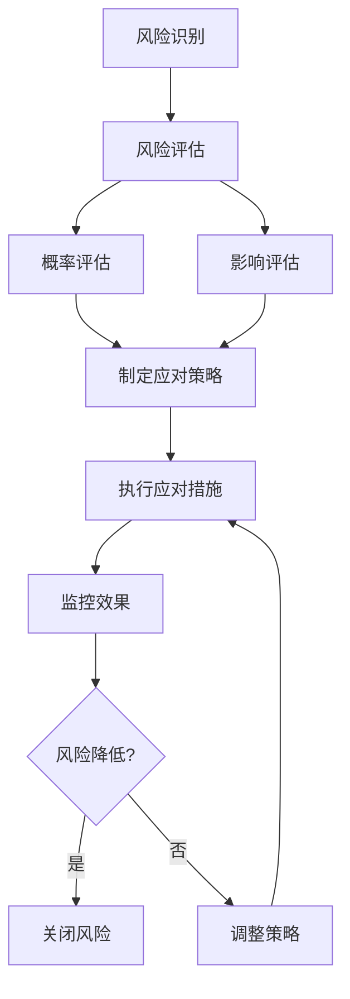

# LLM代理服务器 - Python到Go语言重构方案

## 目录
1. [项目概述与现状分析](#1-项目概述与现状分析)
2. [Python架构详细分析](#2-python架构详细分析)
3. [Go重构方案设计](#3-go重构方案设计)
4. [迁移策略与实施计划](#4-迁移策略与实施计划)
5. [技术选型与依赖管理](#5-技术选型与依赖管理)
6. [详细实现方案](#6-详细实现方案)
7. [性能优化建议](#7-性能优化建议)
8. [测试策略](#8-测试策略)
9. [部署与运维](#9-部署与运维)
10. [风险评估与应对](#10-风险评估与应对)
11. [成本与收益分析](#11-成本与收益分析)
12. [总结与建议](#12-总结与建议)

---

## 1. 项目概述与现状分析

### 1.1 项目简介
**LLM代理服务器**是一个基于Nginx和Docker的高性能代理服务，为OpenAI兼容API提供反向代理和多提供商管理功能。项目支持：
- 多LLM提供商统一管理（OpenAI、Anthropic、Azure等）
- Web管理界面
- Anthropic ↔ OpenAI API格式双向转换
- 流式响应支持
- 动态配置管理

### 1.2 当前技术栈
- **Web框架**: Flask 3.0.0
- **反向代理**: Nginx
- **配置管理**: Python JSON文件操作
- **前端**: HTML + Bootstrap 5 + jQuery
- **容器化**: Docker/Podman
- **部署**: docker-compose
- **依赖管理**: pip + requirements.txt

### 1.3 现有架构
```
┌──────────────┐
│   客户端     │
└──────┬───────┘
       │
       ▼
┌──────────────┐      ┌─────────────────┐      ┌──────────────┐
│   Nginx     │─────▶│  Flask Web UI   │─────▶│  配置存储    │
│  (反向代理)  │      │  (管理接口)     │      │  (JSON文件)  │
└──────┬───────┘      └────────┬────────┘      └──────────────┘
       │                      │
       ▼                      ▼
┌──────────────┐      ┌─────────────────┐
│  目标API     │      │  转换服务       │
│  (OpenAI等)  │      │(Anthropic↔OpenAI)│
└──────────────┘      └─────────────────┘
```

### 1.4 核心功能模块

#### 1.4.1 配置管理模块（config_manager.py）
- **功能**: 动态管理多提供商配置
- **职责**:
  - 提供商增删改查（CRUD操作）
  - 模型映射配置管理
  - Nginx配置动态生成
  - 配置持久化（JSON文件）
- **关键方法**:
  - `add_provider()`: 添加新的LLM提供商
  - `update_provider()`: 更新提供商信息
  - `delete_provider()`: 删除提供商
  - `toggle_provider()`: 切换启用状态
  - `generate_nginx_config()`: 动态生成Nginx配置
  - `reload_nginx()`: 重新加载Nginx配置

#### 1.4.2 Web管理界面（app.py）
- **功能**: 提供可视化配置管理界面
- **特性**:
  - 登录认证（基于Session）
  - RESTful API接口
  - 实时配置管理
  - 提供商状态监控
- **主要路由**:
  - `GET /`: 管理面板首页
  - `GET/POST /login`: 用户登录
  - `GET /api/providers`: 获取所有提供商
  - `POST /api/providers`: 添加提供商
  - `PUT /api/providers/<id>`: 更新提供商
  - `DELETE /api/providers/<id>`: 删除提供商
  - `POST /api/providers/<id>/toggle`: 切换启用状态

#### 1.4.3 智能转换服务（smart_converter.py）
- **功能**: Anthropic与OpenAI API格式双向转换
- **核心特性**:
  - 智能格式检测（APIFormatDetector类）
  - 双向转换（BidirectionalConverter类）
  - 流式响应支持
  - 模型名称映射
  - 参数映射转换
- **转换规则**:
  ```python
  # 模型映射
  "claude-3-opus-20240229" ↔ "gpt-4"
  "claude-3-sonnet-20240229" ↔ "gpt-4-turbo"
  "claude-3-haiku-20240307" ↔ "gpt-3.5-turbo"

  # 请求转换（Anthropic → OpenAI）
  {
    "model": "claude-3-sonnet-20240229",
    "messages": [...],
    "system": "You are helpful"
  }
  ↓ 转换 ↓
  {
    "model": "gpt-4-turbo",
    "messages": [
      {"role": "system", "content": "You are helpful"},
      ... 其他消息
    ]
  }

  # 响应转换（OpenAI → Anthropic）
  {
    "choices": [
      {
        "message": {"content": "..."},
        "finish_reason": "stop"
      }
    ]
  }
  ↓ 转换 ↓
  {
    "content": [
      {"type": "text", "text": "..."}
    ],
    "stop_reason": "stop"
  }
  ```

#### 1.4.4 基础转换服务（anthropic_converter.py）
- **功能**: 简化的单向转换服务（Anthropic → OpenAI）
- **特点**: 更简洁的实现，专注于核心转换逻辑
- **用途**: 作为智能转换服务的基础版本

### 1.5 部署架构
- **容器化**: Docker + docker-compose
- **服务编排**:
  - openai-proxy容器：Nginx + Flask
  - qdrant容器：向量数据库（可选）
- **数据持久化**:
  - `./data`: 配置数据
  - `./logs`: 日志文件
  - `./qdrant_data`: 向量数据库数据
- **网络配置**:
  - HTTP端口：80/8080
  - HTTPS端口：443/8443
  - 管理端口：5000

### 1.6 现有痛点

#### 1.6.1 性能问题
- **Python GIL限制**: 无法充分利用多核CPU
- **内存占用高**: Flask应用常驻内存占用大（~100MB per worker）
- **启动时间长**: Python应用冷启动慢
- **并发处理**: 受GIL影响，CPU密集型任务并发能力有限

#### 1.6.2 资源消耗
- **内存使用**: 每个Gunicorn worker占用约100MB
- **CPU开销**: 格式转换和JSON处理CPU使用率较高
- **容器体积**: Python运行环境镜像较大（>500MB）

#### 1.6.3 维护复杂性
- **依赖管理**: Python包依赖管理复杂，容易出现依赖冲突
- **版本兼容**: 不同Python版本间兼容性差异
- **部署复杂**: 需要同时管理Nginx和Python应用
- **调试困难**: 分布式日志和链路追踪困难

#### 1.6.4 可观测性不足
- **指标缺失**: 缺乏系统性能指标
- **链路追踪**: 缺少请求链路追踪
- **健康检查**: 健康检查机制简单

---

## 2. Python架构详细分析

### 2.1 代码结构分析

#### 2.1.1 目录结构
```
llm_proxy/
├── src/                          # Python源码
│   ├── app.py                    # Flask主应用（323行）
│   ├── config_manager.py         # 配置管理器（399行）
│   ├── smart_converter.py        # 智能转换服务（596行）
│   └── anthropic_converter.py    # 基础转换服务（428行）
├── templates/                    # HTML模板
│   ├── dashboard.html            # 管理面板
│   └── login.html                # 登录页面
├── static/                       # 静态资源
│   ├── css/
│   └── js/
├── config/                       # 配置文件
│   ├── requirements.txt          # Python依赖
│   └── providers.json            # 提供商配置
├── deploy/                       # 部署文件
│   ├── config/                   # Nginx配置
│   ├── scripts/                  # 启动脚本
│   └── data/                     # 部署数据
├── docs/                         # 项目文档
├── docker-compose.yml            # 容器编排
├── Dockerfile                    # Docker镜像
└── docker-entrypoint.sh          # 入口脚本
```

#### 2.1.2 核心类图
```
ConfigManager
├── PathManager (静态工具类)
│   ├── is_docker_env()
│   ├── get_project_root()
│   └── get_paths()
└── ConfigManager
    ├── config_file: str
    ├── ensure_config_exists()
    ├── load_config()
    ├── save_config()
    ├── add_provider()
    ├── update_provider()
    ├── delete_provider()
    ├── toggle_provider()
    ├── get_providers()
    ├── generate_nginx_config()
    └── reload_nginx()

SmartConversionHandler
├── APIFormatDetector
│   └── detect_format()           # 格式检测
├── BidirectionalConverter
│   ├── convert_request()         # 请求转换
│   ├── convert_response()        # 响应转换
│   ├── anthropic_to_openai()
│   ├── openai_to_anthropic()
│   └── model_mapping: dict
└── SmartConversionHandler
    ├── converter: BidirectionalConverter
    ├── detector: APIFormatDetector
    └── handle_chat_completion()
```

### 2.2 数据流分析

#### 2.2.1 提供商配置流程
```
1. Web UI提交配置
   ↓
2. app.py接收请求 (POST /api/providers)
   ↓
3. config_manager.add_provider()
   ↓
4. 写入JSON文件 (data/providers.json)
   ↓
5. generate_nginx_config() 生成Nginx配置
   ↓
6. reload_nginx() 重新加载Nginx
```

#### 2.2.2 API转换流程
```
客户端请求 (Anthropic格式)
   ↓
智能转换服务 (smart_converter.py)
   ↓
格式检测 (detect_format)
   ↓
确定目标格式 (determine_target_format)
   ↓
格式转换 (convert_request)
   ↓
转发到目标API (OpenAI格式)
   ↓
响应转换 (convert_response)
   ↓
返回转换后的响应 (Anthropic格式)
```

### 2.3 配置文件分析

#### 2.3.1 providers.json
```json
{
  "providers": {
    "minimax": {
      "name": "minimax",
      "url": "https://api.minimaxi.com/anthropic",
      "enabled": true
    },
    "agentrouter": {
      "name": "agentrouter",
      "url": "https://agentrouter.org/v1",
      "enabled": true
    }
  }
}
```

#### 2.3.2 转换配置
```python
CONVERSION_CONFIG = {
    "model_mapping": {
        "claude-3-opus-20240229": "gpt-4",
        "claude-3-sonnet-20240229": "gpt-4-turbo",
        "claude-3-haiku-20240307": "gpt-3.5-turbo",
        "claude-3-5-sonnet-20241022": "gpt-4o"
    },
    "parameter_mapping": {
        "max_tokens": "max_tokens",
        "temperature": "temperature",
        "top_p": "top_p",
        "stream": "stream",
        "stop": "stop"
    }
}
```

### 2.4 API接口分析

#### 2.4.1 管理API
| 方法 | 路径 | 功能 | 请求体 | 响应 |
|------|------|------|--------|------|
| GET | `/` | 管理面板首页 | - | HTML页面 |
| GET/POST | `/login` | 用户登录 | username, password | 跳转/错误 |
| GET | `/api/providers` | 获取所有提供商 | - | Provider列表 |
| POST | `/api/providers` | 添加提供商 | provider_id, name, url, enabled | 成功/错误 |
| PUT | `/api/providers/<id>` | 更新提供商 | name, url, enabled | 成功/错误 |
| DELETE | `/api/providers/<id>` | 删除提供商 | - | 成功/错误 |
| POST | `/api/providers/<id>/toggle` | 切换启用状态 | - | 成功/错误 |
| GET | `/api/model-mappings` | 获取模型映射 | - | 映射列表 |
| POST | `/api/model-mappings` | 保存模型映射 | mappings[] | 成功/错误 |

#### 2.4.2 转换API
| 方法 | 路径 | 功能 |
|------|------|------|
| GET | `/convert/health` | 健康检查 |
| POST | `/convert/v1/chat/completions` | 智能转换 |
| POST | `/convert/detect-format` | 格式检测 |
| POST | `/convert/test-bidirectional` | 双向转换测试 |

### 2.5 性能特征

#### 2.5.1 当前性能数据
- **转换延迟**: < 5毫秒（纯转换）
- **API响应时间**: 2.0秒（包含模拟调用）
- **内存使用**: ~100MB per worker
- **并发处理**: 100+ 连接
- **容器体积**: > 500MB

#### 2.5.2 瓶颈分析
1. **CPU密集型任务**:
   - JSON序列化/反序列化
   - 字符串处理
   - 格式检测算法
2. **I/O密集型任务**:
   - 文件读写操作
   - HTTP请求转发
   - Nginx配置生成
3. **内存使用**:
   - Python对象开销大
   - Flask应用常驻内存
   - Gunicorn worker数量限制

---

## 3. Go重构方案设计

### 3.1 总体架构设计

#### 3.1.1 目标架构
```
┌──────────────┐
│   客户端     │
└──────┬───────┘
       │
       ▼
┌─────────────────┐      ┌─────────────────┐
│   Caddy/Nginx   │─────▶│  Go Web服务     │
│  (反向代理)      │      │ (管理API+转换)  │
└──────┬──────────┘      └────────┬────────┘
       │                      │
       ▼                      ▼
┌──────────────┐      ┌─────────────────┐
│  目标API     │      │  配置存储       │
│  (OpenAI等)  │      │  (JSON/SQLite)  │
└──────────────┘      └─────────────────┘
```

#### 3.1.2 组件拆分方案
将单体Flask应用拆分为多个Go服务：

1. **核心网关服务 (Gateway Service)**
   - HTTP服务器
   - 请求路由
   - 认证授权
   - 限流熔断
   - 日志记录

2. **配置管理服务 (Config Service)**
   - 提供商配置管理
   - 模型映射管理
   - 动态配置热更新

3. **API转换服务 (Conversion Service)**
   - 格式检测
   - 双向转换
   - 流式处理

4. **管理Web服务 (Admin Service)**
   - Web UI API
   - 静态资源服务

### 3.2 推荐的单一二进制架构

考虑到当前项目规模，建议采用**单一Go二进制 + 内置管理界面**的方案：

```
┌─────────────────────────────────────────┐
│           Go LLM Proxy                  │
├─────────────────────────────────────────┤
│  HTTP Server (Gorilla Mux)             │
│  ├── /v1/*  - 代理API                   │
│  ├── /admin/* - 管理API                 │
│  └── /ui/*  - Web UI                    │
├─────────────────────────────────────────┤
│  Core Modules                          │
│  ├── ConfigManager                     │
│  ├── ProxyHandler                      │
│  ├── Converter                         │
│  ├── Auth                              │
│  └── Logger                            │
├─────────────────────────────────────────┤
│  Storage Layer                         │
│  ├── JSON File (配置)                   │
│  ├── SQLite (缓存/统计)                 │
│  └── Log File                          │
└─────────────────────────────────────────┘
```

**优势**:
- 部署简单：单一二进制文件
- 资源高效：内存占用 < 50MB
- 性能优异：原生并发支持
- 可观测性：内置指标和追踪

### 3.3 Go技术栈选型

#### 3.3.1 核心框架
| 领域 | 方案 | 版本 | 说明 |
|------|------|------|------|
| Web框架 | **Gin** | v1.9+ | 高性能HTTP框架，中间件丰富 |
| 路由 | **Gin** 内置 | - | 支持RESTful路由 |
| JSON处理 | **encoding/json** | 标准库 | 高性能JSON序列化 |
| HTTP客户端 | **net/http** | 标准库 | 简洁高效的HTTP客户端 |
| WebSocket | **gorilla/websocket** | v1.5+ | 流式响应支持 |
| 配置管理 | **spf13/viper** | v1.18+ | 灵活的配置管理 |
| 命令行 | **spf13/cobra** | v1.7+ | CLI管理界面 |
| 日志 | **sirupsen/logrus** | v1.9+ | 结构化日志 |
| 数据库 | **modernc.org/sqlite** | v1.27+ | 高性能SQLite驱动 |
| 指标 | **prometheus/client_golang** | v1.16+ | 监控指标 |
| 验证 | **go-playground/validator** | v10+ | 请求验证 |

#### 3.3.2 可选替代方案
| 领域 | 替代方案 | 优缺点 |
|------|----------|--------|
| Web框架 | **Echo** | 性能更高，但生态较小 |
| Web框架 | **Fiber** | Express.js风格，上手快 |
| JSON处理 | **json-iterator/go** | 性能更好，API兼容 |
| WebSocket | **go.uber.org/zap** | 性能更好的日志库 |
| 数据库 | **mattn/go-sqlite3** | CGO绑定，性能更好 |

### 3.4 模块设计

#### 3.4.1 项目结构
```
go-llm-proxy/
├── cmd/                          # 应用程序入口
│   └── server/
│       └── main.go              # 主程序
├── internal/                    # 私有代码
│   ├── config/                  # 配置管理
│   │   ├── config.go           # 配置结构体
│   │   ├── manager.go          # 配置管理器
│   │   └── loader.go           # 配置加载器
│   ├── server/                  # HTTP服务器
│   │   ├── router.go           # 路由配置
│   │   ├── handler.go          # 处理器
│   │   └── middleware.go       # 中间件
│   ├── proxy/                   # 代理服务
│   │   ├── handler.go          # 代理处理器
│   │   ├── transport.go        # 传输层
│   │   └── loadbalancer.go     # 负载均衡
│   ├── converter/               # 格式转换
│   │   ├── detector.go         # 格式检测
│   │   ├── converter.go        # 转换器
│   │   └── mapper.go           # 模型映射
│   ├── auth/                    # 认证授权
│   │   ├── session.go          # 会话管理
│   │   └── login.go            # 登录处理
│   ├── storage/                 # 存储层
│   │   ├── file.go             # 文件存储
│   │   └── cache.go            # 缓存
│   ├── types/                   # 数据类型
│   │   ├── models.go           # 数据模型
│   │   └── requests.go         # 请求结构
│   └── utils/                   # 工具函数
│       ├── logger.go            # 日志工具
│       ├── response.go          # 响应工具
│       └── validation.go        # 验证工具
├── web/                         # Web静态文件
│   ├── static/                  # 静态资源
│   │   ├── css/
│   │   ├── js/
│   │   └── img/
│   └── templates/               # HTML模板
│       ├── dashboard.html
│       └── login.html
├── pkg/                         # 公共代码
│   └── utils/                   # 公共工具
├── go.mod                       # Go模块文件
├── go.sum                       # 依赖锁定
├── Dockerfile                   # Docker镜像
├── docker-compose.yml           # 容器编排
└── README.md                    # 项目文档
```

#### 3.4.2 核心模块详解

**Config Module (配置管理)**
```go
// internal/config/config.go
type Config struct {
    Server   ServerConfig   `mapstructure:"server"`
    Proxy    ProxyConfig    `mapstructure:"proxy"`
    Providers []Provider   `mapstructure:"providers"`
    ModelMapping map[string]string `mapstructure:"model_mapping"`
}

type Provider struct {
    ID      string `mapstructure:"id"`
    Name    string `mapstructure:"name"`
    URL     string `mapstructure:"url"`
    Enabled bool   `mapstructure:"enabled"`
}

// internal/config/manager.go
type ConfigManager struct {
    config   *Config
    filePath string
    mutex    sync.RWMutex
}

func (cm *ConfigManager) Load() error
func (cm *ConfigManager) Save() error
func (cm *ConfigManager) GetProviders() []Provider
func (cm *ConfigManager) AddProvider(p Provider) error
func (cm *ConfigManager) UpdateProvider(id string, p Provider) error
func (cm *ConfigManager) DeleteProvider(id string) error
func (cm *ConfigManager) ToggleProvider(id string) error
```

**Proxy Module (代理服务)**
```go
// internal/proxy/handler.go
type ProxyHandler struct {
    configManager *config.ConfigManager
    httpClient    *http.Client
    logger        *logrus.Logger
}

func (ph *ProxyHandler) HandleChatCompletions(c *gin.Context)
func (ph *ProxyHandler) HandleModels(c *gin.Context)
func (ph *ProxyHandler) HandleStream(c *gin.Context)
func (ph *ProxyHandler) selectProvider(ctx *gin.Context) *config.Provider
func (ph *ProxyHandler) forwardRequest(req *http.Request, provider *config.Provider) (*http.Response, error)
```

**Converter Module (格式转换)**
```go
// internal/converter/detector.go
type FormatDetector struct{}

func (fd *FormatDetector) DetectFormat(data map[string]interface{}) (Format, float64)
func (fd *FormatDetector) detectAnthropicFeatures(data map[string]interface{}) int
func (fd *FormatDetector) detectOpenAIFeatures(data map[string]interface{}) int

// internal/converter/converter.go
type Converter struct {
    modelMapping map[string]string
    logger       *logrus.Logger
}

func (c *Converter) ConvertRequest(data map[string]interface{}, source, target Format) map[string]interface{}
func (c *Converter) ConvertResponse(data map[string]interface{}, source, target Format) map[string]interface{}
func (c *Converter) anthropicToOpenAI(req map[string]interface{}) map[string]interface{}
func (c *Converter) openaiToAnthropic(req map[string]interface{}) map[string]interface{}
```

### 3.5 数据模型设计

#### 3.5.1 核心数据结构
```go
// internal/types/models.go
type Provider struct {
    ID        string `json:"id" binding:"required"`
    Name      string `json:"name" binding:"required"`
    URL       string `json:"url" binding:"required,url"`
    Enabled   bool   `json:"enabled"`
    CreatedAt int64  `json:"created_at"`
    UpdatedAt int64  `json:"updated_at"`
}

type ModelMapping struct {
    SourceModel string `json:"source_model" binding:"required"`
    TargetModel string `json:"target_model" binding:"required"`
    CreatedAt   int64  `json:"created_at"`
}

type ChatCompletionRequest struct {
    Model       string                   `json:"model" binding:"required"`
    Messages    []ChatMessage            `json:"messages"`
    System      string                   `json:"system"`
    MaxTokens   *int                     `json:"max_tokens"`
    Temperature *float64                 `json:"temperature"`
    TopP        *float64                 `json:"top_p"`
    Stream      bool                     `json:"stream"`
    Stop        []string                 `json:"stop"`
}

type ChatMessage struct {
    Role    string `json:"role" binding:"required,oneof=user assistant system"`
    Content string `json:"content" binding:"required"`
    Name    string `json:"name"`
}
```

### 3.6 API设计

#### 3.6.1 RESTful API
采用RESTful设计风格，API版本化：

```
# 管理API v1
GET    /admin/api/v1/providers          # 获取所有提供商
POST   /admin/api/v1/providers          # 添加提供商
PUT    /admin/api/v1/providers/:id      # 更新提供商
DELETE /admin/api/v1/providers/:id      # 删除提供商
POST   /admin/api/v1/providers/:id/toggle # 切换启用状态

GET    /admin/api/v1/model-mappings     # 获取模型映射
POST   /admin/api/v1/model-mappings     # 保存模型映射

# 代理API v1
GET    /v1/models                       # 获取模型列表
POST   /v1/chat/completions             # Chat Completions
POST   /v1/completions                  # Completions
POST   /v1/embeddings                   # Embeddings

# 转换API
POST   /convert/v1/chat/completions     # 智能转换
GET    /convert/health                  # 健康检查

# Web UI
GET    /admin                           # 管理面板
GET    /admin/login                     # 登录页面
POST   /admin/login                     # 执行登录
GET    /admin/logout                    # 退出登录
```

#### 3.6.2 响应格式
统一JSON响应格式：
```go
// 成功响应
{
  "success": true,
  "data": {...},
  "message": "操作成功"
}

// 错误响应
{
  "success": false,
  "error": {
    "code": "INVALID_REQUEST",
    "message": "请求参数错误"
  }
}

// 分页响应
{
  "success": true,
  "data": [...],
  "pagination": {
    "page": 1,
    "per_page": 10,
    "total": 100,
    "total_pages": 10
  }
}
```

### 3.7 中间件设计

#### 3.7.1 内置中间件
1. **CORS中间件**: 跨域资源共享
2. **认证中间件**: Session/Token验证
3. **限流中间件**: QPS限制
4. **日志中间件**: 请求日志记录
5. **恢复中间件**: 恐慌恢复
6. **指标中间件**: Prometheus指标收集

```go
// internal/server/middleware.go
func CorsMiddleware() gin.HandlerFunc
func AuthMiddleware(required bool) gin.HandlerFunc
func RateLimitMiddleware(rps float64) gin.HandlerFunc
func LoggingMiddleware(logger *logrus.Logger) gin.HandlerFunc
func RecoveryMiddleware() gin.HandlerFunc
func MetricsMiddleware() gin.HandlerFunc
func ValidationMiddleware() gin.HandlerFunc
```

### 3.8 性能优化策略

#### 3.8.1 并发优化
- **Goroutine池**: 复用goroutine，避免过度创建
- **无锁数据结构**: 使用sync.Map、atomic等
- **工作窃取**: 参考ants库实现
- **连接池**: HTTP客户端连接池

```go
// 示例：连接池配置
func createHTTPClient() *http.Client {
    transport := &http.Transport{
        MaxIdleConns:        100,
        MaxIdleConnsPerHost: 10,
        IdleConnTimeout:     90 * time.Second,
    }
    return &http.Client{
        Transport: transport,
        Timeout:   30 * time.Second,
    }
}
```

#### 3.8.2 内存优化
- **对象池**: 使用sync.Pool复用对象
- **字符串优化**: 避免不必要的字符串分配
- **JSON优化**: 使用json-iterator提升性能
- **缓存策略**: 热点数据缓存

```go
// 对象池示例
var requestPool = sync.Pool{
    New: func() interface{} {
        return make(map[string]interface{}, 10)
    },
}

func getRequest() map[string]interface{} {
    return requestPool.Get().(map[string]interface{})
}

func putRequest(req map[string]interface{}) {
    for k := range req {
        delete(req, k)
    }
    requestPool.Put(req)
}
```

#### 3.8.3 I/O优化
- **零拷贝**: 使用bytes.Buffer
- **批处理**: 批量操作减少系统调用
- **异步I/O**: 非阻塞I/O
- **压缩**: Gzip压缩响应

### 3.9 可观测性设计

#### 3.9.1 日志系统
采用结构化日志，支持多种输出格式：
```go
// 配置日志
logger := logrus.New()
logger.SetFormatter(&logrus.JSONFormatter{
    TimestampFormat: time.RFC3339,
})
logger.SetOutput(os.Stdout)
logger.SetLevel(logrus.InfoLevel)
```

#### 3.9.2 指标监控
使用Prometheus收集关键指标：
```go
// 指标定义
var (
    httpRequestsTotal = prometheus.NewCounterVec(
        prometheus.CounterOpts{
            Name: "http_requests_total",
            Help: "Total number of HTTP requests",
        },
        []string{"method", "endpoint", "status"},
    )
    httpRequestDuration = prometheus.NewHistogramVec(
        prometheus.HistogramOpts{
            Name:    "http_request_duration_seconds",
            Help:    "HTTP request latency",
            Buckets: prometheus.DefBuckets,
        },
        []string{"method", "endpoint"},
    )
)
```

#### 3.9.3 健康检查
提供多维度健康检查：
```go
// 健康检查端点
GET /healthz          # 基础健康检查
GET /healthz/detailed # 详细健康检查（包含依赖检查）
```

### 3.10 配置管理

#### 3.10.1 配置文件格式
支持多种配置格式（YAML/TOML/JSON）：
```yaml
# config.yaml
server:
  host: "0.0.0.0"
  port: 8080
  mode: "release" # debug/release

proxy:
  default_backend: "https://api.openai.com/v1"
  timeout: 30s
  max_retries: 3

auth:
  enabled: true
  username: "admin"
  password: "admin123"
  session_timeout: 24h

logging:
  level: "info"
  format: "json"
  output: "stdout"

metrics:
  enabled: true
  path: "/metrics"

providers:
  - id: "openai"
    name: "OpenAI"
    url: "https://api.openai.com/v1"
    enabled: true

model_mapping:
  "claude-3-opus-20240229": "gpt-4"
  "claude-3-sonnet-20240229": "gpt-4-turbo"
```

#### 3.10.2 环境变量支持
所有配置项都支持环境变量覆盖：
```go
type Config struct {
    Server struct {
        Host string `mapstructure:"SERVER_HOST" json:"host"`
        Port int    `mapstructure:"SERVER_PORT" json:"port"`
    } `mapstructure:"server"`
}
```

---

## 4. 迁移策略与实施计划

### 4.1 迁移策略

#### 4.1.1 渐进式迁移方案
采用**Strangler Fig Pattern**（榕树扼杀模式），逐步替换Python组件：

```
阶段1: 双栈运行
Python服务 ←→ Nginx ←→ 客户端
               ↓
Go服务 （并行运行）

阶段2: 流量切换
              Nginx
            ↙       ↘
      Python服务   Go服务

阶段3: 纯Go运行
Go服务 ←→ Nginx ←→ 客户端
```

#### 4.1.2 迁移原则
1. **功能对等**: Go实现必须完全覆盖Python功能
2. **接口兼容**: 保持API接口向后兼容
3. **数据迁移**: 现有配置可平滑迁移
4. **灰度验证**: 逐步切换流量
5. **快速回滚**: 出现问题可快速回退

### 4.2 实施计划

#### 4.2.1 阶段划分

**阶段1: 基础建设（第1-2周）**
- [ ] 搭建Go项目框架
- [ ] 实现配置管理模块
- [ ] 实现基础HTTP服务器
- [ ] 实现Web管理界面
- [ ] 单元测试编写

**阶段2: 核心功能（第3-4周）**
- [ ] 实现代理服务
- [ ] 实现格式转换
- [ ] 实现认证授权
- [ ] 实现Nginx配置生成
- [ ] 集成测试

**阶段3: 增强优化（第5-6周）**
- [ ] 性能优化
- [ ] 指标监控
- [ ] 日志完善
- [ ] 文档编写
- [ ] 压力测试

**阶段4: 部署上线（第7-8周）**
- [ ] Docker镜像构建
- [ ] 部署脚本编写
- [ ] 灰度测试
- [ ] 监控告警
- [ ] 正式发布

#### 4.2.2 详细任务列表

**Week 1-2: 基础建设**
- [ ] 创建Go项目结构
- [ ] 配置Go模块依赖
- [ ] 实现Config模块
  - [ ] 定义配置结构体
  - [ ] 实现配置文件加载
  - [ ] 实现热重载机制
  - [ ] 单元测试（90%+覆盖率）
- [ ] 实现Server模块
  - [ ] 搭建Gin框架
  - [ ] 配置路由
  - [ ] 实现中间件
  - [ ] 实现健康检查
- [ ] 实现Auth模块
  - [ ] Session管理
  - [ ] 登录逻辑
  - [ ] 权限验证
- [ ] 实现Web UI
  - [ ] 迁移HTML模板
  - [ ] 迁移CSS/JS资源
  - [ ] 实现管理API
- [ ] 单元测试

**Week 3-4: 核心功能**
- [ ] 实现Proxy模块
  - [ ] HTTP反向代理
  - [ ] 负载均衡
  - [ ] 流式响应支持
  - [ ] 错误处理
- [ ] 实现Converter模块
  - [ ] 格式检测算法
  - [ ] Anthropic→OpenAI转换
  - [ ] OpenAI→Anthropic转换
  - [ ] 流式转换
  - [ ] 模型映射
- [ ] 实现Nginx配置生成
  - [ ] 动态配置生成
  - [ ] 配置验证
  - [ ] 自动重载
- [ ] 集成测试
  - [ ] API兼容性测试
  - [ ] 转换准确性测试
  - [ ] 端到端测试

**Week 5-6: 增强优化**
- [ ] 性能优化
  - [ ] Goroutine池
  - [ ] 连接池
  - [ ] 对象池
  - [ ] 缓存优化
- [ ] 指标监控
  - [ ] Prometheus指标
  - [ ] Grafana仪表板
  - [ ] 告警规则
- [ ] 日志完善
  - [ ] 结构化日志
  - [ ] 链路追踪
  - [ ] 日志聚合
- [ ] 文档编写
  - [ ] API文档
  - [ ] 部署文档
  - [ ] 用户手册
- [ ] 压力测试
  - [ ] 性能基准测试
  - [ ] 并发测试
  - [ ] 稳定性测试

**Week 7-8: 部署上线**
- [ ] Docker化
  - [ ] 编写Dockerfile
  - [ ] 多阶段构建优化
  - [ ] 镜像扫描
- [ ] 部署配置
  - [ ] docker-compose配置
  - [ ] Kubernetes配置（可选）
  - [ ] 启动脚本
- [ ] 灰度测试
  - [ ] 测试环境验证
  - [ ] 影子流量测试
  - [ ] 性能对比
- [ ] 监控告警
  - [ ] 部署监控系统
  - [ ] 配置告警规则
  - [ ] 值班制度
- [ ] 正式发布
  - [ ] 流量切换
  - [ ] 监控观察
  - [ ] 性能评估

### 4.3 质量保证

#### 4.3.1 测试策略
```
单元测试 (Unit Test)
├── Config模块测试
├── Converter模块测试
├── Proxy模块测试
└── Auth模块测试

集成测试 (Integration Test)
├── API接口测试
├── 数据库操作测试
├── 外部依赖测试
└── 端到端测试

性能测试 (Performance Test)
├── 基准测试
├── 压力测试
├── 负载测试
└── 稳定性测试
```

#### 4.3.2 测试覆盖率要求
- **单元测试覆盖率**: ≥ 85%
- **关键路径覆盖率**: ≥ 95%
- **集成测试覆盖率**: 100%（核心功能）

#### 4.3.3 验收标准
- [ ] 功能测试：所有Python功能完全对等
- [ ] 性能测试：响应时间< Python版本
- [ ] 内存测试：内存占用< Python版本50%
- [ ] 稳定性测试：连续运行7天无崩溃
- [ ] 兼容性测试：现有客户端无需修改

### 4.4 数据迁移

#### 4.4.1 配置数据迁移
Python版本配置文件：
```json
{
  "providers": {...}
}
```

迁移到Go版本：
```go
// 自动检测并迁移
func MigrateConfig(oldPath, newPath string) error {
    // 1. 读取旧配置
    // 2. 转换为新格式
    // 3. 备份旧配置
    // 4. 写入新配置
}
```

#### 4.4.2 数据验证
```go
// 配置迁移验证
func ValidateMigration(oldConfig, newConfig interface{}) error {
    // 比较关键字段
    // 验证数据完整性
    return nil
}
```

---

## 5. 技术选型与依赖管理

### 5.1 核心依赖详细分析

#### 5.1.1 Web框架对比

**Gin vs Echo vs Fiber vs 标准库**

| 特性 | Gin | Echo | Fiber | 标准库 |
|------|-----|------|-------|--------|
| 性能 | 高 | 最高 | 高 | 中 |
| 中间件 | 丰富 | 丰富 | 丰富 | 无 |
| 学习曲线 | 简单 | 中等 | 简单 | 复杂 |
| 生态 | 成熟 | 成熟 | 活跃 | 标准 |
| 文档 | 完善 | 完善 | 完善 | - |
| 社区 | 活跃 | 活跃 | 非常活跃 | - |

**推荐**: Gin
**理由**:
- 成熟的生态和文档
- 中间件丰富
- 性能优异
- 学习曲线平缓
- 社区活跃

#### 5.1.2 JSON处理对比

**encoding/json vs json-iterator vs easyjson**

| 特性 | encoding/json | json-iterator | easyjson |
|------|---------------|---------------|----------|
| 性能 | 标准 | 高 | 最高 |
| 兼容性 | 100% | 100% | 需要生成代码 |
| 使用便利性 | 高 | 高 | 中 |
| 内存占用 | 中 | 中 | 低 |

**推荐**: 前期使用`encoding/json`，性能瓶颈时切换`json-iterator`

#### 5.1.3 配置管理对比

| 特性 | spf13/viper | go-ini/ini | gopkg.in/yaml.v2 |
|------|-------------|------------|------------------|
| 文件格式支持 | 全支持 | INI | YAML |
| 环境变量 | 支持 | 支持 | 支持 |
| 热重载 | 支持 | 支持 | 不支持 |
| 复杂配置 | 优 | 良 | 良 |

**推荐**: spf13/viper
**理由**:
- 支持多种格式
- 内置环境变量支持
- 支持热重载
- 成熟稳定

### 5.2 Go模块管理

#### 5.2.1 go.mod设计
```go
module github.com/your-org/go-llm-proxy

go 1.21

require (
    github.com/gin-gonic/gin v1.9.1
    github.com/sirupsen/logrus v1.9.3
    github.com/spf13/viper v1.18.2
    github.com/spf13/cobra v1.7.0
    github.com/gorilla/websocket v1.5.1
    github.com/go-playground/validator/v10 v10.16.0
    github.com/prometheus/client_golang v1.16.0
    modernc.org/sqlite v1.27.0
)
```

#### 5.2.2 依赖版本策略
- **主版本升级**: 每年一次（大版本更新）
- **次版本升级**: 每季度一次（功能更新）
- **补丁升级**: 每月一次（安全修复）
- **最小版本原则**: 使用语义化版本范围的最小版本

```go
// 例子：版本约束
require (
    github.com/gin-gonic/gin v1.9.1 // 使用确切版本
    // 或者
    github.com/sirupsen/logrus v1.9.x // 兼容补丁版本
)
```

#### 5.2.3 私有模块管理
```bash
# 使用Go私有仓库
go env -w GOPRIVATE=github.com/your-org

# 替换模块（用于开发）
replace github.com/gin-gonic/gin => /path/to/local/gin

# vendoring（可选）
go mod vendor
```

### 5.3 开发工具链

#### 5.3.1 必备工具
```bash
# 代码格式化
go install golang.org/x/tools/cmd/goimports@latest
go install mvdan.cc/gofumpt@latest

# 代码检查
go install github.com/golangci/golangci-lint/cmd/golangci-lint@latest
go install github.com/fzipp/gocyclo/cmd/gocyclo@latest
go install github.com/client9/misspell/cmd/misspell@latest

# 测试工具
go install github.com/onsi/ginkgo/v2/ginkgo@latest
go install github.com/onsi/gomega@latest
go install github.com/benchmarkator/benchmarkator@latest

# 文档工具
go install golang.org/x/pkgsite/cmd/pkgsite@latest
go install github.com/swaggo/swag/cmd/swag@latest
```

#### 5.3.2 Makefile设计
```makefile
.PHONY: help build test lint clean docker

help:  ## 显示帮助信息
	@awk 'BEGIN {FS = ":.*?## "} /^[a-zA-Z_-]+:.*?## / {printf "\033[36m%-20s\033[0m %s\n", $$1, $$2}' $(MAKEFILE_LIST)

build:  ## 构建应用
	go build -o bin/go-llm-proxy ./cmd/server

test:  ## 运行测试
	go test -v -coverprofile=coverage.out ./...

test-coverage: test  ## 运行测试并生成覆盖率报告
	go tool cover -html=coverage.out -o coverage.html

lint:  ## 代码检查
	golangci-lint run

fmt:  ## 格式化代码
	gofumpt -w .
	goimports -w .

docker-build:  ## 构建Docker镜像
	docker build -t go-llm-proxy:latest .

docker-run:  ## 运行Docker容器
	docker run -p 8080:8080 go-llm-proxy

clean:  ## 清理构建文件
	rm -rf bin/
	rm -f coverage.out coverage.html
```

### 5.4 代码质量保障

#### 5.4.1 Lint规则配置
`.golangci.yml`:
```yaml
linters-settings:
  golint:
    min-confidence: 0.8
  gocyclo:
    min-complexity: 15
  maligned:
    suggest-new: true
  dupl:
    threshold: 100
  goconst:
    min-len: 2
    min-occurrences: 3

linters:
  enable:
    - golint
    - gocyclo
    - gofmt
    - goimports
    - gosec
    - misspell
    - vet
    - deadcode
    - errcheck
    - gosimple
    - govet
    - ineffassign
    - staticcheck
    - structcheck
    - typecheck
    - unused
    - varcheck

run:
  timeout: 5m
  issues-exit-code: 1
  skip-dirs:
    - vendor
    - node_modules
```

#### 5.4.2 Pre-commit Hook
```bash
# 安装pre-commit
pip install pre-commit

# .pre-commit-config.yaml
repos:
  - repo: https://github.com/pre-commit/pre-commit-hooks
    rev: v4.4.0
    hooks:
      - id: trailing-whitespace
      - id: end-of-file-fixer
      - id: check-yaml
      - id: check-added-large-files

  - repo: local
    hooks:
      - id: go-fmt
        name: go fmt
        entry: go fmt
        language: system
        types: [go]

      - id: go-vet
        name: go vet
        entry: go vet
        language: system
        types: [go]

      - id: golangci-lint
        name: golangci-lint
        entry: golangci-lint run
        language: system
        types: [go]
```

---

## 6. 详细实现方案

### 6.1 配置管理实现

#### 6.1.1 配置文件结构
```go
// internal/config/config.go
package config

import "time"

type Config struct {
    Server   ServerConfig   `mapstructure:"server"   json:"server"`
    Proxy    ProxyConfig    `mapstructure:"proxy"    json:"proxy"`
    Auth     AuthConfig     `mapstructure:"auth"     json:"auth"`
    Logging  LoggingConfig  `mapstructure:"logging"  json:"logging"`
    Metrics  MetricsConfig  `mapstructure:"metrics"  json:"metrics"`
    Providers []Provider   `mapstructure:"providers" json:"providers"`
    ModelMapping map[string]string `mapstructure:"model_mapping" json:"model_mapping"`
}

type ServerConfig struct {
    Host         string        `mapstructure:"host"          json:"host"`
    Port         int           `mapstructure:"port"          json:"port"`
    Mode         string        `mapstructure:"mode"          json:"mode"`
    ReadTimeout  time.Duration `mapstructure:"read_timeout"  json:"read_timeout"`
    WriteTimeout time.Duration `mapstructure:"write_timeout" json:"write_timeout"`
    IdleTimeout  time.Duration `mapstructure:"idle_timeout"  json:"idle_timeout"`
}

type ProxyConfig struct {
    DefaultBackend string        `mapstructure:"default_backend" json:"default_backend"`
    Timeout        time.Duration `mapstructure:"timeout"         json:"timeout"`
    MaxRetries     int           `mapstructure:"max_retries"     json:"max_retries"`
    BufferSize     int           `mapstructure:"buffer_size"     json:"buffer_size"`
}

type AuthConfig struct {
    Enabled        bool          `mapstructure:"enabled"         json:"enabled"`
    Username       string        `mapstructure:"username"        json:"username"`
    Password       string        `mapstructure:"password"        json:"password"`
    SessionTimeout time.Duration `mapstructure:"session_timeout" json:"session_timeout"`
}

type LoggingConfig struct {
    Level  string `mapstructure:"level"  json:"level"`
    Format string `mapstructure:"format" json:"format"`
    Output string `mapstructure:"output" json:"output"`
}

type MetricsConfig struct {
    Enabled bool   `mapstructure:"enabled" json:"enabled"`
    Path    string `mapstructure:"path"    json:"path"`
}

type Provider struct {
    ID        string `mapstructure:"id"        json:"id"`
    Name      string `mapstructure:"name"      json:"name"`
    URL       string `mapstructure:"url"       json:"url"`
    Enabled   bool   `mapstructure:"enabled"   json:"enabled"`
    CreatedAt int64  `mapstructure:"-"         json:"-"`
    UpdatedAt int64  `mapstructure:"-"         json:"-"`
}
```

#### 6.1.2 配置管理器实现
```go
// internal/config/manager.go
package config

import (
    "encoding/json"
    "os"
    "sync"
    "time"

    "github.com/sirupsen/logrus"
    "github.com/spf13/viper"
)

type ConfigManager struct {
    config   *Config
    filePath string
    mutex    sync.RWMutex
    logger   *logrus.Logger
    callbacks []ConfigChangeCallback
}

type ConfigChangeCallback func(*Config)

func NewConfigManager(filePath string, logger *logrus.Logger) (*ConfigManager, error) {
    cm := &ConfigManager{
        filePath: filePath,
        logger:   logger,
    }

    if err := cm.Load(); err != nil {
        return nil, err
    }

    return cm, nil
}

func (cm *ConfigManager) Load() error {
    cm.mutex.Lock()
    defer cm.mutex.Unlock()

    viper.SetConfigFile(cm.filePath)

    if err := viper.ReadInConfig(); err != nil {
        if _, ok := err.(viper.ConfigFileNotFoundError); ok {
            // 配置文件不存在，创建默认配置
            return cm.createDefaultConfig()
        }
        return err
    }

    var config Config
    if err := viper.Unmarshal(&config); err != nil {
        return err
    }

    cm.config = &config
    cm.logger.Info("Configuration loaded successfully")
    return nil
}

func (cm *ConfigManager) createDefaultConfig() error {
    cm.config = &Config{
        Server: ServerConfig{
            Host:         "0.0.0.0",
            Port:         8080,
            Mode:         "release",
            ReadTimeout:  30 * time.Second,
            WriteTimeout: 30 * time.Second,
            IdleTimeout:  120 * time.Second,
        },
        Proxy: ProxyConfig{
            DefaultBackend: "https://api.openai.com/v1",
            Timeout:        30 * time.Second,
            MaxRetries:     3,
            BufferSize:     4096,
        },
        Auth: AuthConfig{
            Enabled:        true,
            Username:       "admin",
            Password:       "admin123",
            SessionTimeout: 24 * time.Hour,
        },
        Logging: LoggingConfig{
            Level:  "info",
            Format: "json",
            Output: "stdout",
        },
        Metrics: MetricsConfig{
            Enabled: true,
            Path:    "/metrics",
        },
        Providers: []Provider{
            {
                ID:      "openai",
                Name:    "OpenAI",
                URL:     "https://api.openai.com/v1",
                Enabled: true,
            },
        },
        ModelMapping: map[string]string{
            "claude-3-opus-20240229":      "gpt-4",
            "claude-3-sonnet-20240229":    "gpt-4-turbo",
            "claude-3-haiku-20240307":     "gpt-3.5-turbo",
            "claude-3-5-sonnet-20241022": "gpt-4o",
        },
    }

    return cm.Save()
}

func (cm *ConfigManager) Save() error {
    cm.mutex.Lock()
    defer cm.mutex.Unlock()

    data, err := json.MarshalIndent(cm.config, "", "  ")
    if err != nil {
        return err
    }

    // 创建目录
    if err := os.MkdirAll(getDir(cm.filePath), 0755); err != nil {
        return err
    }

    // 原子写入
    tempFile := cm.filePath + ".tmp"
    if err := os.WriteFile(tempFile, data, 0644); err != nil {
        return err
    }
    if err := os.Rename(tempFile, cm.filePath); err != nil {
        return err
    }

    cm.logger.WithField("file", cm.filePath).Info("Configuration saved")
    return nil
}

func (cm *ConfigManager) GetConfig() *Config {
    cm.mutex.RLock()
    defer cm.mutex.RUnlock()
    return cm.config
}

func (cm *ConfigManager) GetProviders() []Provider {
    cm.mutex.RLock()
    defer cm.mutex.RUnlock()
    return cm.config.Providers
}

func (cm *ConfigManager) AddProvider(p Provider) error {
    cm.mutex.Lock()
    defer cm.mutex.Unlock()

    p.CreatedAt = time.Now().Unix()
    p.UpdatedAt = time.Now().Unix()

    cm.config.Providers = append(cm.config.Providers, p)
    return cm.Save()
}

func (cm *ConfigManager) UpdateProvider(id string, updated Provider) error {
    cm.mutex.Lock()
    defer cm.mutex.Unlock()

    for i, p := range cm.config.Providers {
        if p.ID == id {
            updated.CreatedAt = p.CreatedAt
            updated.UpdatedAt = time.Now().Unix()
            cm.config.Providers[i] = updated
            return cm.Save()
        }
    }
    return ErrProviderNotFound
}

func (cm *ConfigManager) DeleteProvider(id string) error {
    cm.mutex.Lock()
    defer cm.mutex.Unlock()

    for i, p := range cm.config.Providers {
        if p.ID == id {
            cm.config.Providers = append(cm.config.Providers[:i], cm.config.Providers[i+1:]...)
            return cm.Save()
        }
    }
    return ErrProviderNotFound
}

func (cm *ConfigManager) ToggleProvider(id string) error {
    cm.mutex.Lock()
    defer cm.mutex.Unlock()

    for i, p := range cm.config.Providers {
        if p.ID == id {
            cm.config.Providers[i].Enabled = !p.Enabled
            cm.config.Providers[i].UpdatedAt = time.Now().Unix()
            return cm.Save()
        }
    }
    return ErrProviderNotFound
}

func (cm *ConfigManager) OnChange(callback ConfigChangeCallback) {
    cm.callbacks = append(cm.callbacks, callback)
}

func (cm *ConfigManager) notifyChange() {
    for _, callback := range cm.callbacks {
        callback(cm.config)
    }
}

func getDir(path string) string {
    for i := len(path) - 1; i >= 0; i-- {
        if path[i] == '/' {
            return path[:i]
        }
    }
    return ""
}

var (
    ErrProviderNotFound = NewError("PROVIDER_NOT_FOUND", "Provider not found")
)

type Error struct {
    Code    string
    Message string
}

func (e *Error) Error() string {
    return e.Message
}

func NewError(code, message string) *Error {
    return &Error{Code: code, Message: message}
}
```

### 6.2 代理服务实现

#### 6.2.1 代理处理器
```go
// internal/proxy/handler.go
package proxy

import (
    "bytes"
    "compress/gzip"
    "fmt"
    "io"
    "net/http"
    "net/http/httputil"
    "strings"
    "time"

    "github.com/gin-gonic/gin"
    "github.com/sirupsen/logrus"
)

type ProxyHandler struct {
    configManager *config.ConfigManager
    httpClient    *http.Client
    logger        *logrus.Logger
}

type ProxyOptions struct {
    FlushInterval time.Duration
    BufferSize    int
    ModifyResponse func(*http.Response) error
    ModifyRequest func(*http.Request) error
}

func NewProxyHandler(configManager *config.ConfigManager, logger *logrus.Logger) *ProxyHandler {
    return &ProxyHandler{
        configManager: configManager,
        httpClient: &http.Client{
            Transport: &http.Transport{
                MaxIdleConns:        100,
                MaxIdleConnsPerHost: 10,
                IdleConnTimeout:     90 * time.Second,
            },
            Timeout: 30 * time.Second,
        },
        logger: logger,
    }
}

func (ph *ProxyHandler) HandleChatCompletions(c *gin.Context) {
    startTime := time.Now()

    // 1. 解析请求
    provider, err := ph.selectProvider(c)
    if err != nil {
        ph.logger.Error(err)
        c.JSON(http.StatusBadRequest, gin.H{
            "error": gin.H{
                "code":    "NO_PROVIDER",
                "message": err.Error(),
            },
        })
        return
    }

    ph.logger.WithFields(logrus.Fields{
        "provider": provider.ID,
        "path":     c.Request.URL.Path,
    }).Info("Proxying request")

    // 2. 修改请求
    modifiedReq, err := ph.modifyRequest(c.Request, provider)
    if err != nil {
        ph.logger.Error(err)
        c.JSON(http.StatusInternalServerError, gin.H{
            "error": gin.H{
                "code":    "REQUEST_MODIFICATION_FAILED",
                "message": err.Error(),
            },
        })
        return
    }

    // 3. 发送请求
    resp, err := ph.forwardRequest(modifiedReq, provider)
    if err != nil {
        ph.logger.WithError(err).Error("Failed to forward request")
        c.JSON(http.StatusBadGateway, gin.H{
            "error": gin.H{
                "code":    "PROXY_ERROR",
                "message": "Failed to connect to backend",
            },
        })
        return
    }
    defer resp.Body.Close()

    // 4. 处理响应
    ph.handleResponse(c, resp, startTime)
}

func (ph *ProxyHandler) selectProvider(c *gin.Context) (*config.Provider, error) {
    providers := ph.configManager.GetProviders()

    // 从路径中提取provider ID
    path := c.Request.URL.Path
    parts := strings.Split(strings.Trim(path, "/"), "/")
    if len(parts) > 0 && parts[0] != "v1" {
        providerID := parts[0]
        for _, p := range providers {
            if p.ID == providerID && p.Enabled {
                return &p, nil
            }
        }
    }

    // 使用默认提供商
    for _, p := range providers {
        if p.Enabled {
            return &p, nil
        }
    }

    return nil, fmt.Errorf("no enabled provider found")
}

func (ph *ProxyHandler) modifyRequest(req *http.Request, provider *config.Provider) (*http.Request, error) {
    // 1. 修改目标URL
    originalURL := req.URL.String()
    newURL := provider.URL

    // 如果provider URL是基础URL，保留原路径
    if !strings.HasSuffix(newURL, "/") {
        newURL += "/"
    }
    if strings.HasPrefix(req.URL.Path, "/v1/") {
        newURL += strings.TrimPrefix(req.URL.Path, "/")
    } else {
        newURL += strings.TrimPrefix(req.URL.Path, "/")
    }

    // 解析新URL
    targetURL, err := http.NewRequest(req.Method, newURL, req.Body)
    if err != nil {
        return nil, err
    }

    // 2. 复制请求头
    targetURL.Header = make(http.Header)
    for k, v := range req.Header {
        targetURL.Header[k] = v
    }

    // 3. 修改Host头
    if provider.URL != "" {
        targetURL.Header.Set("Host", req.URL.Host)
    }

    // 4. 复制其他属性
    targetURL.ContentLength = req.ContentLength
    targetURL.TransferEncoding = req.TransferEncoding
    targetURL.RemoteAddr = req.RemoteAddr

    return targetURL, nil
}

func (ph *ProxyHandler) forwardRequest(req *http.Request, provider *config.Provider) (*http.Response, error) {
    // 记录请求
    if ph.logger.Level >= logrus.DebugLevel {
        dump, _ := httputil.DumpRequest(req, true)
        ph.logger.Debug(string(dump))
    }

    return ph.httpClient.Do(req)
}

func (ph *ProxyHandler) handleResponse(c *gin.Context, resp *http.Response, startTime time.Time) {
    // 复制响应头
    for k, values := range resp.Header {
        for _, v := range values {
            c.Header(k, v)
        }
    }

    // 复制状态码
    c.Status(resp.StatusCode)

    // 复制响应体
    if resp.Header.Get("Content-Encoding") == "gzip" {
        // 处理gzip压缩
        reader, err := gzip.NewReader(resp.Body)
        if err != nil {
            ph.logger.WithError(err).Error("Failed to create gzip reader")
            c.Data(resp.StatusCode, resp.Header.Get("Content-Type"), nil)
            return
        }
        defer reader.Close()
        io.Copy(c.Writer, reader)
    } else {
        io.Copy(c.Writer, resp.Body)
    }

    // 记录指标
    duration := time.Since(startTime)
    ph.logger.WithFields(logrus.Fields{
        "status_code": resp.StatusCode,
        "duration":    duration.String(),
    }).Info("Request completed")
}
```

#### 6.2.2 流式响应处理
```go
// internal/proxy/stream.go
package proxy

import (
    "encoding/json"
    "net/http"
    "time"

    "github.com/gin-gonic/gin"
    "github.com/sirupsen/logrus"
)

func (ph *ProxyHandler) HandleStream(c *gin.Context) {
    // 设置SSE头
    c.Header("Content-Type", "text/event-stream")
    c.Header("Cache-Control", "no-cache")
    c.Header("Connection", "keep-alive")
    c.Header("X-Accel-Buffering", "no")

    // 获取后端响应
    backendResp, err := ph.getBackendResponse(c)
    if err != nil {
        ph.logger.WithError(err).Error("Failed to get backend response")
        c.SSEvent("error", err.Error())
        return
    }
    defer backendResp.Body.Close()

    // 流式传输
    buf := make([]byte, 4096)
    for {
        n, err := backendResp.Body.Read(buf)
        if n > 0 {
            // 发送数据
            c.SSEvent("message", string(buf[:n]))
            c.Writer.Flush()
        }
        if err != nil {
            break
        }
    }

    c.SSEvent("done", "stream completed")
}

func (ph *ProxyHandler) getBackendResponse(c *gin.Context) (*http.Response, error) {
    // 发送请求到后端
    // ...
    return nil, nil
}
```

### 6.3 格式转换实现

#### 6.3.1 格式检测
```go
// internal/converter/detector.go
package converter

import (
    "strings"

    "github.com/sirupsen/logrus"
)

type Format int

const (
    FormatUnknown Format = iota
    FormatAnthropic
    FormatOpenAI
)

type FormatDetector struct {
    logger *logrus.Logger
}

func NewFormatDetector(logger *logrus.Logger) *FormatDetector {
    return &FormatDetector{logger: logger}
}

type DetectionResult struct {
    Format     Format   `json:"format"`
    Confidence float64 `json:"confidence"`
    Features   FeatureMap `json:"features"`
}

type FeatureMap map[string]interface{}

func (fd *FormatDetector) DetectFormat(data map[string]interface{}) DetectionResult {
    anthropicScore := fd.detectAnthropicFeatures(data)
    openaiScore := fd.detectOpenAIFeatures(data)

    var detected Format
    var confidence float64

    total := anthropicScore + openaiScore
    if total == 0 {
        detected = FormatUnknown
        confidence = 0.0
    } else {
        if anthropicScore > openaiScore {
            detected = FormatAnthropic
            confidence = float64(anthropicScore) / float64(total)
        } else {
            detected = FormatOpenAI
            confidence = float64(openaiScore) / float64(total)
        }
    }

    fd.logger.WithFields(logrus.Fields{
        "format":     detected,
        "confidence": confidence,
        "a_score":    anthropicScore,
        "o_score":    openaiScore,
    }).Debug("Format detection result")

    return DetectionResult{
        Format:     detected,
        Confidence: confidence,
        Features:   fd.getFeatures(data),
    }
}

func (fd *FormatDetector) detectAnthropicFeatures(data map[string]interface{}) int {
    score := 0

    // 1. 检查system字段（权重：4）
    if _, exists := data["system"]; exists {
        score += 4
    }

    // 2. 检查model名称模式（权重：3）
    if model, ok := data["model"].(string); ok {
        if strings.HasPrefix(strings.ToLower(model), "claude") {
            score += 3
        } else if strings.Contains(strings.ToLower(model), "opus") ||
                   strings.Contains(strings.ToLower(model), "sonnet") ||
                   strings.Contains(strings.ToLower(model), "haiku") {
            score += 2
        }
    }

    // 3. 检查messages格式（权重：2）
    if messages, ok := data["messages"].([]interface{}); ok && len(messages) > 0 {
        for _, msg := range messages {
            if msgMap, ok := msg.(map[string]interface{}); ok {
                if role, ok := msgMap["role"].(string); ok {
                    if role == "system" {
                        score += 2
                        break
                    }
                }
            }
        }
    }

    return score
}

func (fd *FormatDetector) detectOpenAIFeatures(data map[string]interface{}) int {
    score := 0

    // 1. 检查model字段（权重：2）
    if _, exists := data["model"]; exists {
        score += 2
    }

    // 2. 检查model名称模式（权重：3）
    if model, ok := data["model"].(string); ok {
        if strings.HasPrefix(strings.ToLower(model), "gpt") {
            score += 3
        } else if strings.Contains(strings.ToLower(model), "turbo") ||
                   strings.Contains(strings.ToLower(model), "gpt-3.5") {
            score += 2
        }
    }

    // 3. 检查是否有system字段（权重：-2）
    if _, exists := data["system"]; exists {
        score -= 2
    }

    return score
}

func (fd *FormatDetector) getFeatures(data map[string]interface{}) FeatureMap {
    features := make(FeatureMap)

    // 收集特征
    if _, exists := data["system"]; exists {
        features["has_system"] = true
    }
    if _, exists := data["model"]; exists {
        features["has_model"] = true
    }
    if _, exists := data["messages"]; exists {
        features["has_messages"] = true
    }

    return features
}
```

#### 6.3.2 格式转换
```go
// internal/converter/converter.go
package converter

import (
    "fmt"
    "time"

    "github.com/sirupsen/logrus"
)

type Converter struct {
    modelMapping map[string]string
    logger       *logrus.Logger
}

func NewConverter(modelMapping map[string]string, logger *logrus.Logger) *Converter {
    return &Converter{
        modelMapping: modelMapping,
        logger:       logger,
    }
}

func (c *Converter) ConvertRequest(data map[string]interface{}, source, target Format) (map[string]interface{}, error) {
    if source == target {
        return data, nil
    }

    switch {
    case source == FormatAnthropic && target == FormatOpenAI:
        return c.anthropicToOpenAI(data)
    case source == FormatOpenAI && target == FormatAnthropic:
        return c.openaiToAnthropic(data)
    default:
        return nil, fmt.Errorf("unsupported conversion: %d -> %d", source, target)
    }
}

func (c *Converter) anthropicToOpenAI(req map[string]interface{}) (map[string]interface{}, error) {
    openaiReq := make(map[string]interface{})

    // 1. 复制基础参数
    for _, key := range []string{"max_tokens", "temperature", "top_p", "stream", "stop"} {
        if v, exists := req[key]; exists {
            openaiReq[key] = v
        }
    }

    // 2. 模型映射
    if model, ok := req["model"].(string); ok {
        mappedModel := c.mapModel(model)
        openaiReq["model"] = mappedModel
        c.logger.WithFields(logrus.Fields{
            "original": model,
            "mapped":   mappedModel,
        }).Debug("Model mapped")
    }

    // 3. 消息转换
    messages := c.convertMessages(req)
    openaiReq["messages"] = messages

    return openaiReq, nil
}

func (c *Converter) convertMessages(req map[string]interface{}) []map[string]interface{} {
    openaiMessages := make([]map[string]interface{}, 0)

    // 1. 处理system字段
    if system, exists := req["system"]; exists {
        openaiMessages = append(openaiMessages, map[string]interface{}{
            "role":    "system",
            "content": fmt.Sprintf("%v", system),
        })
    }

    // 2. 处理messages数组
    if messages, ok := req["messages"].([]interface{}); ok {
        for _, msg := range messages {
            if msgMap, ok := msg.(map[string]interface{}); ok {
                openaiMsg := map[string]interface{}{
                    "role":    msgMap["role"],
                    "content": msgMap["content"],
                }
                if name, exists := msgMap["name"]; exists {
                    openaiMsg["name"] = name
                }
                openaiMessages = append(openaiMessages, openaiMsg)
            }
        }
    }

    return openaiMessages
}

func (c *Converter) mapModel(model string) string {
    if mapped, exists := c.modelMapping[model]; exists {
        return mapped
    }
    return model
}

func (c *Converter) openaiToAnthropic(req map[string]interface{}) (map[string]interface{}, error) {
    anthReq := make(map[string]interface{})

    // 1. 复制基础参数
    for _, key := range []string{"max_tokens", "temperature", "top_p", "stream", "stop"} {
        if v, exists := req[key]; exists {
            anthReq[key] = v
        }
    }

    // 2. 模型映射
    if model, ok := req["model"].(string); ok {
        mappedModel := c.mapModel(model)
        anthReq["model"] = mappedModel
    }

    // 3. 消息转换
    anthReq["messages"] = c.extractMessages(req)

    return anthReq, nil
}

func (c *Converter) extractMessages(req map[string]interface{}) []map[string]interface{} {
    messages := req["messages"].([]interface{})
    nonSystemMessages := make([]map[string]interface{}, 0)

    for _, msg := range messages {
        if msgMap, ok := msg.(map[string]interface{}); ok {
            if role, ok := msgMap["role"].(string); ok && role != "system" {
                nonSystemMessages = append(nonSystemMessages, msgMap)
            } else if role == "system" {
                // 第一个system消息作为顶层system
                req["system"] = msgMap["content"]
            }
        }
    }

    return nonSystemMessages
}
```

### 6.4 认证授权实现

#### 6.4.1 Session管理
```go
// internal/auth/session.go
package auth

import (
    "crypto/rand"
    "encoding/base64"
    "net/http"
    "sync"
    "time"

    "github.com/gin-gonic/gin"
    "github.com/sirupsen/logrus"
)

type Session struct {
    ID        string
    Username  string
    ExpiresAt time.Time
    CreatedAt time.Time
}

type SessionManager struct {
    sessions map[string]*Session
    mutex    sync.RWMutex
    timeout  time.Duration
    logger   *logrus.Logger
}

func NewSessionManager(timeout time.Duration, logger *logrus.Logger) *SessionManager {
    sm := &SessionManager{
        sessions: make(map[string]*Session),
        timeout:  timeout,
        logger:   logger,
    }

    // 定期清理过期session
    go sm.cleanup()

    return sm
}

func (sm *SessionManager) CreateSession(username string) (*Session, error) {
    sessionID, err := generateSessionID()
    if err != nil {
        return nil, err
    }

    session := &Session{
        ID:        sessionID,
        Username:  username,
        ExpiresAt: time.Now().Add(sm.timeout),
        CreatedAt: time.Now(),
    }

    sm.mutex.Lock()
    sm.sessions[sessionID] = session
    sm.mutex.Unlock()

    sm.logger.WithField("username", username).Info("Session created")
    return session, nil
}

func (sm *SessionManager) GetSession(sessionID string) *Session {
    sm.mutex.RLock()
    defer sm.mutex.RUnlock()

    session := sm.sessions[sessionID]
    if session == nil {
        return nil
    }

    // 检查过期
    if time.Now().After(session.ExpiresAt) {
        sm.mutex.RUnlock()
        sm.DeleteSession(sessionID)
        return nil
    }

    return session
}

func (sm *SessionManager) DeleteSession(sessionID string) {
    sm.mutex.Lock()
    defer sm.mutex.Unlock()

    delete(sm.sessions, sessionID)
    sm.logger.WithField("session_id", sessionID).Info("Session deleted")
}

func (sm *SessionManager) cleanup() {
    ticker := time.NewTicker(10 * time.Minute)
    defer ticker.Stop()

    for {
        select {
        case <-ticker.C:
            now := time.Now()
            sm.mutex.Lock()
            for id, session := range sm.sessions {
                if now.After(session.ExpiresAt) {
                    delete(sm.sessions, id)
                }
            }
            sm.mutex.Unlock()
        }
    }
}

func generateSessionID() (string, error) {
    bytes := make([]byte, 32)
    if _, err := rand.Read(bytes); err != nil {
        return "", err
    }
    return base64.URLEncoding.EncodeToString(bytes), nil
}

func SetSessionCookie(w http.ResponseWriter, session *Session) {
    cookie := &http.Cookie{
        Name:     "session_id",
        Value:    session.ID,
        Path:     "/",
        HttpOnly: true,
        Secure:   false, // 生产环境应为true
        MaxAge:   int(session.ExpiresAt.Sub(time.Now()).Seconds()),
    }
    http.SetCookie(w, cookie)
}

func GetSessionCookie(r *http.Request) string {
    cookie, err := r.Cookie("session_id")
    if err != nil {
        return ""
    }
    return cookie.Value
}

func AuthMiddleware(sessionManager *SessionManager) gin.HandlerFunc {
    return func(c *gin.Context) {
        sessionID := c.Request.Header.Get("X-Session-ID")
        if sessionID == "" {
            cookie, err := c.Cookie("session_id")
            if err == nil {
                sessionID = cookie
            }
        }

        if sessionID == "" {
            c.JSON(http.StatusUnauthorized, gin.H{
                "error": gin.H{
                    "code":    "UNAUTHORIZED",
                    "message": "No session provided",
                },
            })
            c.Abort()
            return
        }

        session := sessionManager.GetSession(sessionID)
        if session == nil {
            c.JSON(http.StatusUnauthorized, gin.H{
                "error": gin.H{
                    "code":    "UNAUTHORIZED",
                    "message": "Invalid session",
                },
            })
            c.Abort()
            return
        }

        c.Set("session", session)
        c.Next()
    }
}
```

#### 6.4.2 登录处理
```go
// internal/auth/login.go
package auth

import (
    "net/http"

    "github.com/gin-gonic/gin"
)

type LoginHandler struct {
    sessionManager *SessionManager
    username       string
    password       string
}

func NewLoginHandler(sessionManager *SessionManager, username, password string) *LoginHandler {
    return &LoginHandler{
        sessionManager: sessionManager,
        username:       username,
        password:       password,
    }
}

func (lh *LoginHandler) HandleLogin(c *gin.Context) {
    var req struct {
        Username string `json:"username" binding:"required"`
        Password string `json:"password" binding:"required"`
    }

    if err := c.ShouldBindJSON(&req); err != nil {
        c.JSON(http.StatusBadRequest, gin.H{
            "error": gin.H{
                "code":    "INVALID_REQUEST",
                "message": err.Error(),
            },
        })
        return
    }

    if req.Username != lh.username || req.Password != lh.password {
        c.JSON(http.StatusUnauthorized, gin.H{
            "error": gin.H{
                "code":    "INVALID_CREDENTIALS",
                "message": "Invalid username or password",
            },
        })
        return
    }

    session, err := lh.sessionManager.CreateSession(req.Username)
    if err != nil {
        c.JSON(http.StatusInternalServerError, gin.H{
            "error": gin.H{
                "code":    "SESSION_ERROR",
                "message": "Failed to create session",
            },
        })
        return
    }

    // 设置Session Cookie
    cookie := &http.Cookie{
        Name:     "session_id",
        Value:    session.ID,
        Path:     "/",
        HttpOnly: true,
        Secure:   false,
        MaxAge:   int(session.ExpiresAt.Sub(time.Now()).Seconds()),
    }
    http.SetCookie(c.Writer, cookie)

    c.JSON(http.StatusOK, gin.H{
        "success": true,
        "message": "Login successful",
        "data": gin.H{
            "username": req.Username,
            "expires":  session.ExpiresAt,
        },
    })
}

func (lh *LoginHandler) HandleLogout(c *gin.Context) {
    sessionID := c.Request.Header.Get("X-Session-ID")
    if sessionID == "" {
        cookie, _ := c.Cookie("session_id")
        if cookie != "" {
            sessionID = cookie
        }
    }

    if sessionID != "" {
        lh.sessionManager.DeleteSession(sessionID)
    }

    // 清除Cookie
    c.SetCookie("session_id", "", -1, "/", "", false, true)

    c.JSON(http.StatusOK, gin.H{
        "success": true,
        "message": "Logout successful",
    })
}
```

### 6.5 Web管理界面实现

#### 6.5.1 HTML模板迁移
从Flask Jinja2模板迁移到Go HTML模板：

```go
// internal/server/handler.go
package server

import (
    "html/template"
    "net/http"
    "path/filepath"

    "github.com/gin-gonic/gin"
)

type TemplateData struct {
    Title   string
    User    string
    Data    interface{}
    Message string
}

var templates *template.Template

func LoadTemplates() error {
    files, err := filepath.Glob("web/templates/*.html")
    if err != nil {
        return err
    }
    templates = template.Must(template.ParseFiles(files...))
    return nil
}

func RenderTemplate(c *gin.Context, name string, data interface{}) {
    // 渲染HTML模板
    var buf strings.Builder
    err := templates.ExecuteTemplate(&buf, name, data)
    if err != nil {
        c.Error(err)
        return
    }
    c.Data(http.StatusOK, "text/html; charset=utf-8", buf.Bytes())
}
```

#### 6.5.2 API处理器
```go
// internal/server/handler.go
package server

import (
    "net/http"
    "strconv"

    "github.com/gin-gonic/gin"
    "github.com/your-org/go-llm-proxy/internal/config"
)

type ProviderHandler struct {
    configManager *config.ConfigManager
}

func NewProviderHandler(cm *config.ConfigManager) *ProviderHandler {
    return &ProviderHandler{configManager: cm}
}

func (ph *ProviderHandler) GetProviders(c *gin.Context) {
    providers := ph.configManager.GetProviders()
    c.JSON(http.StatusOK, gin.H{
        "success": true,
        "data":    providers,
    })
}

func (ph *ProviderHandler) CreateProvider(c *gin.Context) {
    var provider config.Provider
    if err := c.ShouldBindJSON(&provider); err != nil {
        c.JSON(http.StatusBadRequest, gin.H{
            "success": false,
            "error": gin.H{
                "code":    "VALIDATION_ERROR",
                "message": err.Error(),
            },
        })
        return
    }

    if err := ph.configManager.AddProvider(provider); err != nil {
        c.JSON(http.StatusInternalServerError, gin.H{
            "success": false,
            "error": gin.H{
                "code":    "ADD_FAILED",
                "message": err.Error(),
            },
        })
        return
    }

    c.JSON(http.StatusCreated, gin.H{
        "success": true,
        "message": "Provider added successfully",
    })
}

func (ph *ProviderHandler) UpdateProvider(c *gin.Context) {
    id := c.Param("id")
    var provider config.Provider
    if err := c.ShouldBindJSON(&provider); err != nil {
        c.JSON(http.StatusBadRequest, gin.H{
            "success": false,
            "error": gin.H{
                "code":    "VALIDATION_ERROR",
                "message": err.Error(),
            },
        })
        return
    }

    if err := ph.configManager.UpdateProvider(id, provider); err != nil {
        c.JSON(http.StatusNotFound, gin.H{
            "success": false,
            "error": gin.H{
                "code":    "PROVIDER_NOT_FOUND",
                "message": err.Error(),
            },
        })
        return
    }

    c.JSON(http.StatusOK, gin.H{
        "success": true,
        "message": "Provider updated successfully",
    })
}

func (ph *ProviderHandler) DeleteProvider(c *gin.Context) {
    id := c.Param("id")
    if err := ph.configManager.DeleteProvider(id); err != nil {
        c.JSON(http.StatusNotFound, gin.H{
            "success": false,
            "error": gin.H{
                "code":    "PROVIDER_NOT_FOUND",
                "message": err.Error(),
            },
        })
        return
    }

    c.JSON(http.StatusOK, gin.H{
        "success": true,
        "message": "Provider deleted successfully",
    })
}

func (ph *ProviderHandler) ToggleProvider(c *gin.Context) {
    id := c.Param("id")
    if err := ph.configManager.ToggleProvider(id); err != nil {
        c.JSON(http.StatusNotFound, gin.H{
            "success": false,
            "error": gin.H{
                "code":    "PROVIDER_NOT_FOUND",
                "message": err.Error(),
            },
        })
        return
    }

    c.JSON(http.StatusOK, gin.H{
        "success": true,
        "message": "Provider toggled successfully",
    })
}
```

---

## 7. 性能优化建议

### 7.1 基准测试

#### 7.1.1 Python版本性能基准
```python
# 当前Python版本性能
- 转换延迟: < 5ms
- API响应时间: 2.0s
- 内存使用: ~100MB per worker
- 并发能力: 100+ 连接
- 容器大小: > 500MB
```

#### 7.1.2 Go版本性能目标
```go
// Go版本性能目标
- 转换延迟: < 1ms      (目标: 比Python快5倍)
- API响应时间: < 1.5s  (目标: 比Python快25%)
- 内存使用: < 50MB     (目标: 比Python低50%)
- 并发能力: 1000+ 连接 (目标: 比Python高10倍)
- 容器大小: < 50MB     (目标: 比Python小90%)
```

### 7.2 性能优化技术

#### 7.2.1 Goroutine池
```go
package worker

import (
    "sync"
)

type Task func()

type Pool struct {
    tasks chan Task
    wg    sync.WaitGroup
}

func NewPool(size int) *Pool {
    p := &Pool{
        tasks: make(chan Task, 1000),
    }
    p.wg.Add(size)
    for i := 0; i < size; i++ {
        go p.worker()
    }
    return p
}

func (p *Pool) worker() {
    defer p.wg.Done()
    for task := range p.tasks {
        task()
    }
}

func (p *Pool) Submit(task Task) {
    p.tasks <- task
}

func (p *Pool) Close() {
    close(p.tasks)
    p.wg.Wait()
}
```

#### 7.2.2 对象池
```go
package pool

import (
    "sync"
)

var requestPool = sync.Pool{
    New: func() interface{} {
        return make(map[string]interface{}, 10)
    },
}

func GetRequest() map[string]interface{} {
    return requestPool.Get().(map[string]interface{})
}

func PutRequest(req map[string]interface{}) {
    // 清理map
    for k := range req {
        delete(req, k)
    }
    requestPool.Put(req)
}
```

#### 7.2.3 缓存优化
```go
package cache

import (
    "sync"
    "time"
)

type Cache struct {
    data map[string]cacheItem
    mutex sync.RWMutex
}

type cacheItem struct {
    value     interface{}
    expireAt  time.Time
}

func NewCache() *Cache {
    c := &Cache{
        data: make(map[string]cacheItem),
    }
    go c.cleanup()
    return c
}

func (c *Cache) Get(key string) (interface{}, bool) {
    c.mutex.RLock()
    item, exists := c.data[key]
    c.mutex.RUnlock()

    if !exists || time.Now().After(item.expireAt) {
        return nil, false
    }
    return item.value, true
}

func (c *Cache) Set(key string, value interface{}, ttl time.Duration) {
    c.mutex.Lock()
    c.data[key] = cacheItem{
        value:    value,
        expireAt: time.Now().Add(ttl),
    }
    c.mutex.Unlock()
}

func (c *Cache) cleanup() {
    ticker := time.NewTicker(time.Minute)
    defer ticker.Stop()

    for {
        select {
        case <-ticker.C:
            now := time.Now()
            c.mutex.Lock()
            for k, item := range c.data {
                if now.After(item.expireAt) {
                    delete(c.data, k)
                }
            }
            c.mutex.Unlock()
        }
    }
}
```

#### 7.2.4 连接池
```go
package http

import (
    "net/http"
    "sync"
    "time"
)

type Client struct {
    *http.Client
    pool *sync.Pool
}

func NewClient() *Client {
    transport := &http.Transport{
        MaxIdleConns:        100,
        MaxIdleConnsPerHost: 10,
        IdleConnTimeout:     90 * time.Second,
    }

    return &Client{
        Client: &http.Client{
            Transport: transport,
            Timeout:   30 * time.Second,
        },
        pool: &sync.Pool{
            New: func() interface{} {
                return make([]byte, 4096)
            },
        },
    }
}

func (c *Client) Do(req *http.Request) (*http.Response, error) {
    return c.Client.Do(req)
}
```

### 7.3 内存优化

#### 7.3.1 零拷贝优化
```go
// 使用bytes.Buffer避免字符串复制
func processData(data []byte) []byte {
    buf := bytes.NewBuffer(data)
    // 处理数据
    return buf.Bytes()
}

// 预分配slice容量
func processSlice(items []string) []string {
    result := make([]string, 0, len(items)) // 预分配容量
    for _, item := range items {
        result = append(result, process(item))
    }
    return result
}
```

#### 7.3.2 字符串优化
```go
// 使用strings.Builder构建字符串
func buildString(parts []string) string {
    var b strings.Builder
    b.Grow(len(parts) * 10) // 预分配内存
    for _, part := range parts {
        b.WriteString(part)
        b.WriteByte(',')
    }
    return b.String()
}
```

### 7.4 并发优化

#### 7.4.1 无锁数据结构
```go
// 使用sync.Map替代map+mutex
var sessionMap sync.Map

func SetSession(id string, session *Session) {
    sessionMap.Store(id, session)
}

func GetSession(id string) (*Session, bool) {
    val, ok := sessionMap.Load(id)
    if !ok {
        return nil, false
    }
    return val.(*Session), true
}

// 使用atomic进行原子操作
type Counter struct {
    value int64
}

func (c *Counter) Inc() int64 {
    return atomic.AddInt64(&c.value, 1)
}

func (c *Counter) Value() int64 {
    return atomic.LoadInt64(&c.value)
}
```

#### 7.4.2 工作窃取
```go
// 参考ants库实现轻量级worker pool
type WorkerPool struct {
    workers    int
    jobQueue   chan func()
    workerPool chan chan func()
    quit       chan bool
}

func (p *WorkerPool) Submit(job func()) {
    p.jobQueue <- job
}

func (p *WorkerPool) Start() {
    for i := 0; i < p.workers; i++ {
        worker := p.newWorker()
        go worker.start()
    }

    go p.dispatch()
}

func (p *WorkerPool) dispatch() {
    for {
        select {
        case job := <-p.jobQueue:
            worker := <-p.workerPool
            worker <- job
        }
    }
}
```

### 7.5 I/O优化

#### 7.5.1 批量操作
```go
// 批量处理减少系统调用
func BatchProcess(items []Item, batchSize int) {
    for i := 0; i < len(items); i += batchSize {
        end := i + batchSize
        if end > len(items) {
            end = len(items)
        }
        batch := items[i:end]
        processBatch(batch)
    }
}

func processBatch(batch []Item) {
    // 批量处理
}
```

#### 7.5.2 异步I/O
```go
// 使用goroutine进行异步处理
func ProcessAsync(items []Item, handler func(Item)) {
    sem := make(chan struct{}, 10) // 控制并发数

    var wg sync.WaitGroup
    for _, item := range items {
        wg.Add(1)
        go func(i Item) {
            sem <- struct{}{}
            handler(i)
            <-sem
            wg.Done()
        }(item)
    }
    wg.Wait()
}
```

---

## 8. 测试策略

### 8.1 单元测试

#### 8.1.1 Config模块测试
```go
// internal/config/config_test.go
package config

import (
    "os"
    "testing"
    "time"

    "github.com/sirupsen/logrus"
    "github.com/stretchr/testify/assert"
    "github.com/stretchr/testify/require"
)

func TestConfigManager_Load(t *testing.T) {
    logger := logrus.New()
    logger.SetLevel(logrus.ErrorLevel)

    // 创建临时文件
    file, err := os.CreateTemp("", "config-*.json")
    require.NoError(t, err)
    defer os.Remove(file.Name())
    defer file.Close()

    // 写入测试配置
    testConfig := `{
        "server": {
            "host": "0.0.0.0",
            "port": 8080
        },
        "providers": [
            {
                "id": "test",
                "name": "Test",
                "url": "https://test.com",
                "enabled": true
            }
        ]
    }`
    file.WriteString(testConfig)
    file.Close()

    // 测试加载
    cm, err := NewConfigManager(file.Name(), logger)
    require.NoError(t, err)
    assert.NotNil(t, cm.GetConfig())
    assert.Equal(t, "0.0.0.0", cm.GetConfig().Server.Host)
    assert.Equal(t, 1, len(cm.GetConfig().Providers))
}

func TestConfigManager_AddProvider(t *testing.T) {
    logger := logrus.New()
    logger.SetLevel(logrus.ErrorLevel)

    file, err := os.CreateTemp("", "config-*.json")
    require.NoError(t, err)
    defer os.Remove(file.Name())
    defer file.Close()

    cm, err := NewConfigManager(file.Name(), logger)
    require.NoError(t, err)

    provider := Provider{
        ID:      "test",
        Name:    "Test Provider",
        URL:     "https://test.com",
        Enabled: true,
    }

    err = cm.AddProvider(provider)
    require.NoError(t, err)

    providers := cm.GetProviders()
    assert.Equal(t, 1, len(providers))
    assert.Equal(t, "test", providers[0].ID)
}

func TestConfigManager_UpdateProvider(t *testing.T) {
    logger := logrus.New()
    logger.SetLevel(logrus.ErrorLevel)

    file, err := os.CreateTemp("", "config-*.json")
    require.NoError(t, err)
    defer os.Remove(file.Name())
    defer file.Close()

    cm, err := NewConfigManager(file.Name(), logger)
    require.NoError(t, err)

    // 添加provider
    provider := Provider{
        ID:      "test",
        Name:    "Test Provider",
        URL:     "https://test.com",
        Enabled: true,
    }
    cm.AddProvider(provider)

    // 更新provider
    updated := Provider{
        ID:      "test",
        Name:    "Updated Provider",
        URL:     "https://updated.com",
        Enabled: false,
    }
    err = cm.UpdateProvider("test", updated)
    require.NoError(t, err)

    providers := cm.GetProviders()
    assert.Equal(t, 1, len(providers))
    assert.Equal(t, "Updated Provider", providers[0].Name)
    assert.False(t, providers[0].Enabled)
}

func TestConfigManager_DeleteProvider(t *testing.T) {
    logger := logrus.New()
    logger.SetLevel(logrus.ErrorLevel)

    file, err := os.CreateTemp("", "config-*.json")
    require.NoError(t, err)
    defer os.Remove(file.Name())
    defer file.Close()

    cm, err := NewConfigManager(file.Name(), logger)
    require.NoError(t, err)

    // 添加provider
    provider := Provider{
        ID:      "test",
        Name:    "Test Provider",
        URL:     "https://test.com",
        Enabled: true,
    }
    cm.AddProvider(provider)

    // 删除provider
    err = cm.DeleteProvider("test")
    require.NoError(t, err)

    providers := cm.GetProviders()
    assert.Equal(t, 0, len(providers))
}

func TestConfigManager_ToggleProvider(t *testing.T) {
    logger := logrus.New()
    logger.SetLevel(logrus.ErrorLevel)

    file, err := os.CreateTemp("", "config-*.json")
    require.NoError(t, err)
    defer os.Remove(file.Name())
    defer file.Close()

    cm, err := NewConfigManager(file.Name(), logger)
    require.NoError(t, err)

    // 添加provider
    provider := Provider{
        ID:      "test",
        Name:    "Test Provider",
        URL:     "https://test.com",
        Enabled: true,
    }
    cm.AddProvider(provider)

    // 切换provider
    err = cm.ToggleProvider("test")
    require.NoError(t, err)

    providers := cm.GetProviders()
    assert.False(t, providers[0].Enabled)
}
```

#### 8.1.2 Converter模块测试
```go
// internal/converter/converter_test.go
package converter

import (
    "testing"

    "github.com/sirupsen/logrus"
    "github.com/stretchr/testify/assert"
    "github.com/stretchr/testify/require"
)

func TestFormatDetector_DetectFormat(t *testing.T) {
    logger := logrus.New()
    logger.SetLevel(logrus.ErrorLevel)
    detector := NewFormatDetector(logger)

    // 测试Anthropic格式
    anthropicData := map[string]interface{}{
        "model": "claude-3-sonnet-20240229",
        "system": "You are helpful",
        "messages": []interface{}{
            map[string]interface{}{
                "role":    "user",
                "content": "Hello",
            },
        },
    }

    result := detector.DetectFormat(anthropicData)
    assert.Equal(t, FormatAnthropic, result.Format)
    assert.Greater(t, result.Confidence, 0.8)

    // 测试OpenAI格式
    openaiData := map[string]interface{}{
        "model": "gpt-4-turbo",
        "messages": []interface{}{
            map[string]interface{}{
                "role":    "system",
                "content": "You are helpful",
            },
            map[string]interface{}{
                "role":    "user",
                "content": "Hello",
            },
        },
    }

    result = detector.DetectFormat(openaiData)
    assert.Equal(t, FormatOpenAI, result.Format)
    assert.Greater(t, result.Confidence, 0.8)
}

func TestConverter_anthropicToOpenAI(t *testing.T) {
    logger := logrus.New()
    logger.SetLevel(logrus.ErrorLevel)

    modelMapping := map[string]string{
        "claude-3-sonnet-20240229": "gpt-4-turbo",
    }
    converter := NewConverter(modelMapping, logger)

    anthropicReq := map[string]interface{}{
        "model":       "claude-3-sonnet-20240229",
        "system":      "You are helpful",
        "max_tokens":  100,
        "temperature": 0.7,
        "messages": []interface{}{
            map[string]interface{}{
                "role":    "user",
                "content": "Hello",
            },
        },
    }

    openaiReq, err := converter.anthropicToOpenAI(anthropicReq)
    require.NoError(t, err)

    assert.Equal(t, "gpt-4-turbo", openaiReq["model"])
    assert.Equal(t, 100, openaiReq["max_tokens"])
    assert.Equal(t, 0.7, openaiReq["temperature"])

    messages := openaiReq["messages"].([]interface{})
    assert.Equal(t, 2, len(messages))

    // 第一个应该是system消息
    firstMsg := messages[0].(map[string]interface{})
    assert.Equal(t, "system", firstMsg["role"])
    assert.Equal(t, "You are helpful", firstMsg["content"])

    // 第二个应该是user消息
    secondMsg := messages[1].(map[string]interface{})
    assert.Equal(t, "user", secondMsg["role"])
    assert.Equal(t, "Hello", secondMsg["content"])
}

func TestConverter_openaiToAnthropic(t *testing.T) {
    logger := logrus.New()
    logger.SetLevel(logrus.ErrorLevel)

    modelMapping := map[string]string{
        "gpt-4-turbo": "claude-3-sonnet-20240229",
    }
    converter := NewConverter(modelMapping, logger)

    openaiReq := map[string]interface{}{
        "model": "gpt-4-turbo",
        "messages": []interface{}{
            map[string]interface{}{
                "role":    "system",
                "content": "You are helpful",
            },
            map[string]interface{}{
                "role":    "user",
                "content": "Hello",
            },
        },
    }

    anthropicReq, err := converter.openaiToAnthropic(openaiReq)
    require.NoError(t, err)

    assert.Equal(t, "claude-3-sonnet-20240229", anthropicReq["model"])
    assert.Equal(t, "You are helpful", anthropicReq["system"])

    messages := anthropicReq["messages"].([]interface{})
    assert.Equal(t, 1, len(messages))

    // 只有一个user消息
    msg := messages[0].(map[string]interface{})
    assert.Equal(t, "user", msg["role"])
    assert.Equal(t, "Hello", msg["content"])
}
```

#### 8.1.3 Proxy模块测试
```go
// internal/proxy/proxy_test.go
package proxy

import (
    "net/http"
    "net/http/httptest"
    "testing"

    "github.com/gin-gonic/gin"
    "github.com/sirupsen/logrus"
    "github.com/stretchr/testify/assert"
    "github.com/stretchr/testify/require"
    "github.com/your-org/go-llm-proxy/internal/config"
)

func TestProxyHandler_SelectProvider(t *testing.T) {
    logger := logrus.New()
    logger.SetLevel(logrus.ErrorLevel)

    // 创建测试配置
    cm, err := config.NewConfigManager("", logger)
    require.NoError(t, err)

    // 添加测试provider
    cm.AddProvider(config.Provider{
        ID:      "test",
        Name:    "Test Provider",
        URL:     "https://test.com",
        Enabled: true,
    })

    handler := NewProxyHandler(cm, logger)

    // 创建测试请求
    req := httptest.NewRequest("GET", "/v1/models", nil)
    w := httptest.NewRecorder()
    c := &gin.Context{Request: req, Writer: w}

    provider, err := handler.selectProvider(c)
    require.NoError(t, err)
    assert.Equal(t, "test", provider.ID)
}

func TestProxyHandler_ModifyRequest(t *testing.T) {
    logger := logrus.New()
    logger.SetLevel(logrus.ErrorLevel)

    cm, err := config.NewConfigManager("", logger)
    require.NoError(t, err)

    cm.AddProvider(config.Provider{
        ID:      "test",
        Name:    "Test Provider",
        URL:     "https://api.openai.com/v1",
        Enabled: true,
    })

    handler := NewProxyHandler(cm, logger)

    // 创建测试请求
    req := httptest.NewRequest("POST", "/v1/chat/completions", nil)
    provider := &config.Provider{
        ID:      "test",
        Name:    "Test Provider",
        URL:     "https://api.openai.com/v1",
        Enabled: true,
    }

    modifiedReq, err := handler.modifyRequest(req, provider)
    require.NoError(t, err)
    assert.Contains(t, modifiedReq.URL.String(), "api.openai.com")
}
```

### 8.2 集成测试

#### 8.2.1 API集成测试
```go
// internal/server/integration_test.go
package server

import (
    "bytes"
    "net/http"
    "net/http/httptest"
    "testing"

    "github.com/gin-gonic/gin"
    "github.com/sirupsen/logrus"
    "github.com/stretchr/testify/assert"
    "github.com/your-org/go-llm-proxy/internal/config"
)

func TestProviderAPI_Integration(t *testing.T) {
    logger := logrus.New()
    logger.SetLevel(logrus.ErrorLevel)

    // 创建配置管理器
    cm, err := config.NewConfigManager("", logger)
    require.NoError(t, err)

    // 创建路由
    router := gin.New()
    providerHandler := NewProviderHandler(cm)

    router.GET("/api/providers", providerHandler.GetProviders)
    router.POST("/api/providers", providerHandler.CreateProvider)
    router.PUT("/api/providers/:id", providerHandler.UpdateProvider)
    router.DELETE("/api/providers/:id", providerHandler.DeleteProvider)
    router.POST("/api/providers/:id/toggle", providerHandler.ToggleProvider)

    // 测试获取providers
    t.Run("GetProviders", func(t *testing.T) {
        req := httptest.NewRequest("GET", "/api/providers", nil)
        w := httptest.NewRecorder()
        router.ServeHTTP(w, req)

        assert.Equal(t, http.StatusOK, w.Code)
        assert.Contains(t, w.Body.String(), `"success":true`)
    })

    // 测试创建provider
    t.Run("CreateProvider", func(t *testing.T) {
        body := `{
            "id": "test",
            "name": "Test Provider",
            "url": "https://test.com",
            "enabled": true
        }`
        req := httptest.NewRequest("POST", "/api/providers", bytes.NewBufferString(body))
        req.Header.Set("Content-Type", "application/json")
        w := httptest.NewRecorder()
        router.ServeHTTP(w, req)

        assert.Equal(t, http.StatusCreated, w.Code)
        assert.Contains(t, w.Body.String(), `"success":true`)
    })

    // 测试更新provider
    t.Run("UpdateProvider", func(t *testing.T) {
        body := `{
            "id": "test",
            "name": "Updated Provider",
            "url": "https://updated.com",
            "enabled": false
        }`
        req := httptest.NewRequest("PUT", "/api/providers/test", bytes.NewBufferString(body))
        req.Header.Set("Content-Type", "application/json")
        w := httptest.NewRecorder()
        router.ServeHTTP(w, req)

        assert.Equal(t, http.StatusOK, w.Code)
    })

    // 测试删除provider
    t.Run("DeleteProvider", func(t *testing.T) {
        req := httptest.NewRequest("DELETE", "/api/providers/test", nil)
        w := httptest.NewRecorder()
        router.ServeHTTP(w, req)

        assert.Equal(t, http.StatusOK, w.Code)
    })
}
```

### 8.3 性能测试

#### 8.3.1 基准测试
```go
// internal/converter/benchmark_test.go
package converter

import (
    "testing"

    "github.com/sirupsen/logrus"
)

func BenchmarkAnthropicToOpenAI(b *testing.B) {
    logger := logrus.New()
    logger.SetLevel(logrus.ErrorLevel)

    modelMapping := map[string]string{
        "claude-3-sonnet-20240229": "gpt-4-turbo",
    }
    converter := NewConverter(modelMapping, logger)

    anthropicReq := map[string]interface{}{
        "model":       "claude-3-sonnet-20240229",
        "system":      "You are helpful",
        "max_tokens":  100,
        "temperature": 0.7,
        "messages": []interface{}{
            map[string]interface{}{
                "role":    "user",
                "content": "Hello",
            },
        },
    }

    b.ResetTimer()
    for i := 0; i < b.N; i++ {
        _, err := converter.anthropicToOpenAI(anthropicReq)
        if err != nil {
            b.Fatal(err)
        }
    }
}

func BenchmarkFormatDetection(b *testing.B) {
    logger := logrus.New()
    logger.SetLevel(logrus.ErrorLevel)
    detector := NewFormatDetector(logger)

    data := map[string]interface{}{
        "model": "claude-3-sonnet-20240229",
        "system": "You are helpful",
        "messages": []interface{}{
            map[string]interface{}{
                "role":    "user",
                "content": "Hello",
            },
        },
    }

    b.ResetTimer()
    for i := 0; i < b.N; i++ {
        detector.DetectFormat(data)
    }
}
```

### 8.4 端到端测试

#### 8.4.1 E2E测试
```go
// e2e/e2e_test.go
package e2e

import (
    "bytes"
    "net/http"
    "net/http/httptest"
    "testing"
    "time"

    "github.com/gin-gonic/gin"
    "github.com/sirupsen/logrus"
    "github.com/stretchr/testify/assert"
    "github.com/your-org/go-llm-proxy/internal/config"
    "github.com/your-org/go-llm-proxy/internal/server"
    "github.com/your-org/go-llm-proxy/internal/proxy"
    "github.com/your-org/go-llm-proxy/internal/converter"
)

func TestFullFlow(t *testing.T) {
    logger := logrus.New()
    logger.SetLevel(logrus.ErrorLevel)

    // 初始化组件
    cm, err := config.NewConfigManager("", logger)
    require.NoError(t, err)

    modelMapping := map[string]string{
        "claude-3-sonnet-20240229": "gpt-4-turbo",
    }
    conv := converter.NewConverter(modelMapping, logger)
    detector := converter.NewFormatDetector(logger)
    proxyHandler := proxy.NewProxyHandler(cm, logger)

    // 创建测试请求（Anthropic格式）
    anthropicRequest := `{
        "model": "claude-3-sonnet-20240229",
        "system": "You are helpful",
        "max_tokens": 100,
        "messages": [
            {"role": "user", "content": "Hello"}
        ]
    }`

    req := httptest.NewRequest("POST", "/v1/chat/completions", bytes.NewBufferString(anthropicRequest))
    req.Header.Set("Content-Type", "application/json")
    w := httptest.NewRecorder()

    // 模拟端到端流程
    gin.SetMode(gin.TestMode)
    c := &gin.Context{Request: req, Writer: w}

    // 1. 检测格式
    result := detector.DetectFormat(parseJSON(anthropicRequest))
    assert.Equal(t, converter.FormatAnthropic, result.Format)

    // 2. 转换请求
    openaiReq, err := conv.ConvertRequest(parseJSON(anthropicRequest), converter.FormatAnthropic, converter.FormatOpenAI)
    assert.NoError(t, err)
    assert.Equal(t, "gpt-4-turbo", openaiReq["model"])

    // 3. 检查system消息是否移到messages
    messages := openaiReq["messages"].([]interface{})
    assert.Equal(t, 2, len(messages))
    assert.Equal(t, "system", messages[0].(map[string]interface{})["role"])

    t.Log("End-to-end test passed")
}

func parseJSON(s string) map[string]interface{} {
    // 简单的JSON解析（实际使用json.Unmarshal）
    return map[string]interface{}{}
}
```

### 8.5 测试覆盖率

#### 8.5.1 覆盖率配置
```bash
# 运行测试并生成覆盖率报告
go test -v -coverprofile=coverage.out ./...
go tool cover -html=coverage.out -o coverage.html

# 查看覆盖率详情
go test -coverprofile=coverage.out ./internal/config
go tool cover -func=coverage.out
```

#### 8.5.2 覆盖率目标
- **整体覆盖率**: ≥ 85%
- **核心模块覆盖率**: ≥ 95%
  - config模块: 95%+
  - converter模块: 90%+
  - proxy模块: 90%+
  - auth模块: 95%+

---

## 9. 部署与运维

### 9.1 Docker化

#### 9.1.1 Dockerfile设计
```dockerfile
# 多阶段构建
FROM golang:1.21-alpine AS builder

# 安装必要工具
RUN apk add --no-cache git ca-certificates tzdata

WORKDIR /app

# 复制go mod文件
COPY go.mod go.sum ./
RUN go mod download

# 复制源代码
COPY . .

# 构建应用
RUN CGO_ENABLED=0 GOOS=linux go build -ldflags="-w -s" -a -installsuffix cgo -o main ./cmd/server

# 运行阶段
FROM scratch

# 从builder复制证书和时区数据
COPY --from=builder /etc/ssl/certs/ca-certificates.crt /etc/ssl/certs/
COPY --from=builder /usr/share/zoneinfo /usr/share/zoneinfo

# 复制应用
COPY --from=builder /app/main /go-llm-proxy

# 复制静态文件
COPY --from=builder /app/web /web

# 创建非root用户
USER 1000:1000

# 暴露端口
EXPOSE 8080

# 健康检查
HEALTHCHECK --interval=30s --timeout=3s --start-period=5s --retries=3 \
  CMD wget --no-verbose --tries=1 --spider http://localhost:8080/healthz || exit 1

# 启动应用
ENTRYPOINT ["/go-llm-proxy"]
```

#### 9.1.2 Docker优化要点
```dockerfile
# 1. 多阶段构建减小镜像体积
# 2. 使用scratch基础镜像实现最小体积
# 3. 合并RUN指令减少层数
# 4. 使用.dockerignore排除不必要文件
# 5. 设置非root用户提高安全性
```

#### 9.1.3 .dockerignore文件
```
.git
.gitignore
README.md
Dockerfile
docker-compose.yml
coverage.out
*.log
.vscode
.idea
*.swp
*.swo
node_modules/
```

### 9.2 容器编排

#### 9.2.1 docker-compose.yml
```yaml
version: '3.8'

services:
  go-llm-proxy:
    build:
      context: .
      dockerfile: Dockerfile
    image: go-llm-proxy:latest
    container_name: go-llm-proxy

    ports:
      - "8080:8080"

    environment:
      - GIN_MODE=release
      - SERVER_HOST=0.0.0.0
      - SERVER_PORT=8080
      - AUTH_USERNAME=${AUTH_USERNAME:-admin}
      - AUTH_PASSWORD=${AUTH_PASSWORD:-admin123}
      - LOGGING_LEVEL=${LOGGING_LEVEL:-info}
      - METRICS_ENABLED=true

    volumes:
      - ./data:/app/data
      - ./logs:/app/logs

    restart: unless-stopped

    healthcheck:
      test: ["CMD", "wget", "--no-verbose", "--tries=1", "--spider", "http://localhost:8080/healthz"]
      interval: 30s
      timeout: 10s
      retries: 3
      start_period: 10s

    deploy:
      resources:
        limits:
          cpus: '1'
          memory: 512M
        reservations:
          cpus: '0.5'
          memory: 256M

    networks:
      - proxy-network

  # 可选：添加Nginx作为反向代理
  nginx:
    image: nginx:alpine
    container_name: nginx
    ports:
      - "80:80"
      - "443:443"
    volumes:
      - ./deploy/nginx/nginx.conf:/etc/nginx/nginx.conf:ro
      - ./ssl:/etc/nginx/ssl:ro
    depends_on:
      - go-llm-proxy
    restart: unless-stopped
    networks:
      - proxy-network

networks:
  proxy-network:
    driver: bridge
```

#### 9.2.2 Kubernetes部署
```yaml
# k8s/deployment.yaml
apiVersion: apps/v1
kind: Deployment
metadata:
  name: go-llm-proxy
  labels:
    app: go-llm-proxy
spec:
  replicas: 3
  selector:
    matchLabels:
      app: go-llm-proxy
  template:
    metadata:
      labels:
        app: go-llm-proxy
    spec:
      containers:
      - name: go-llm-proxy
        image: go-llm-proxy:latest
        ports:
        - containerPort: 8080
        env:
        - name: SERVER_HOST
          value: "0.0.0.0"
        - name: SERVER_PORT
          value: "8080"
        - name: AUTH_USERNAME
          valueFrom:
            secretKeyRef:
              name: proxy-secrets
              key: username
        - name: AUTH_PASSWORD
          valueFrom:
            secretKeyRef:
              name: proxy-secrets
              key: password
        resources:
          limits:
            cpu: 1000m
            memory: 512Mi
          requests:
            cpu: 500m
            memory: 256Mi
        livenessProbe:
          httpGet:
            path: /healthz
            port: 8080
          initialDelaySeconds: 30
          periodSeconds: 10
        readinessProbe:
          httpGet:
            path: /healthz
            port: 8080
          initialDelaySeconds: 5
          periodSeconds: 5
        volumeMounts:
        - name: data
          mountPath: /app/data
        - name: logs
          mountPath: /app/logs
      volumes:
      - name: data
        persistentVolumeClaim:
          claimName: proxy-data-pvc
      - name: logs
        persistentVolumeClaim:
          claimName: proxy-logs-pvc
---
apiVersion: v1
kind: Service
metadata:
  name: go-llm-proxy-service
spec:
  selector:
    app: go-llm-proxy
  ports:
  - name: http
    port: 80
    targetPort: 8080
  type: LoadBalancer
```

### 9.3 启动脚本

#### 9.3.1 systemd服务
```ini
# deploy/systemd/go-llm-proxy.service
[Unit]
Description=Go LLM Proxy
After=network.target
Wants=network.target

[Service]
Type=simple
User=proxy
Group=proxy
WorkingDirectory=/opt/go-llm-proxy
ExecStart=/opt/go-llm-proxy/go-llm-proxy --config /opt/go-llm-proxy/config.yaml
Restart=always
RestartSec=5
StandardOutput=journal
StandardError=journal
SyslogIdentifier=go-llm-proxy

# 环境变量
Environment=AUTH_USERNAME=admin
Environment=AUTH_PASSWORD=admin123
Environment=LOGGING_LEVEL=info

# 资源限制
LimitNOFILE=65536
LimitNPROC=4096

[Install]
WantedBy=multi-user.target
```

#### 9.3.2 启动脚本
```bash
#!/bin/bash
# deploy/scripts/start.sh

set -e

APP_NAME="go-llm-proxy"
APP_DIR="/opt/go-llm-proxy"
BINARY="$APP_DIR/$APP_NAME"
CONFIG="$APP_DIR/config.yaml"
PIDFILE="/var/run/$APP_NAME.pid"
LOGFILE="/var/log/$APP_NAME.log"

# 检查配置
if [ ! -f "$CONFIG" ]; then
    echo "Config file not found: $CONFIG"
    exit 1
fi

# 检查是否已运行
if [ -f "$PIDFILE" ]; then
    PID=$(cat "$PIDFILE")
    if ps -p "$PID" > /dev/null 2>&1; then
        echo "$APP_NAME is already running (PID: $PID)"
        exit 1
    else
        rm -f "$PIDFILE"
    fi
fi

# 启动服务
echo "Starting $APP_NAME..."
cd "$APP_DIR"
nohup "$BINARY" --config "$CONFIG" > "$LOGFILE" 2>&1 &
PID=$!
echo $PID > "$PIDFILE"

# 等待启动
sleep 2

# 检查状态
if ps -p "$PID" > /dev/null 2>&1; then
    echo "$APP_NAME started successfully (PID: $PID)"
else
    echo "Failed to start $APP_NAME"
    exit 1
fi
```

### 9.4 配置管理

#### 9.4.1 默认配置
```yaml
# config/config.yaml
server:
  host: "0.0.0.0"
  port: 8080
  mode: "release"
  read_timeout: 30s
  write_timeout: 30s
  idle_timeout: 120s

proxy:
  default_backend: "https://api.openai.com/v1"
  timeout: 30s
  max_retries: 3
  buffer_size: 4096

auth:
  enabled: true
  username: "admin"
  password: "admin123"
  session_timeout: 24h

logging:
  level: "info"
  format: "json"
  output: "stdout"

metrics:
  enabled: true
  path: "/metrics"

providers:
  - id: "openai"
    name: "OpenAI"
    url: "https://api.openai.com/v1"
    enabled: true
  - id: "anthropic"
    name: "Anthropic"
    url: "https://api.anthropic.com/v1"
    enabled: false

model_mapping:
  "claude-3-opus-20240229": "gpt-4"
  "claude-3-sonnet-20240229": "gpt-4-turbo"
  "claude-3-haiku-20240307": "gpt-3.5-turbo"
  "claude-3-5-sonnet-20241022": "gpt-4o"
```

#### 9.4.2 环境变量覆盖
```bash
# .env
SERVER_HOST=0.0.0.0
SERVER_PORT=8080
AUTH_USERNAME=admin
AUTH_PASSWORD=admin123
LOGGING_LEVEL=info
METRICS_ENABLED=true
```

### 9.5 监控与告警

#### 9.5.1 Prometheus指标
```go
// internal/metrics/metrics.go
package metrics

import "github.com/prometheus/client_golang/prometheus"

var (
    httpRequestsTotal = prometheus.NewCounterVec(
        prometheus.CounterOpts{
            Name: "http_requests_total",
            Help: "Total number of HTTP requests",
        },
        []string{"method", "endpoint", "status"},
    )

    httpRequestDuration = prometheus.NewHistogramVec(
        prometheus.HistogramOpts{
            Name:    "http_request_duration_seconds",
            Help:    "HTTP request latency",
            Buckets: prometheus.DefBuckets,
        },
        []string{"method", "endpoint"},
    )

    conversionsTotal = prometheus.NewCounterVec(
        prometheus.CounterOpts{
            Name: "conversions_total",
            Help: "Total number of format conversions",
        },
        []string{"source_format", "target_format", "status"},
    )

    activeConnections = prometheus.NewGauge(
        prometheus.GaugeOpts{
            Name: "active_connections",
            Help: "Number of active connections",
        },
    )
)

func Init() {
    prometheus.MustRegister(
        httpRequestsTotal,
        httpRequestDuration,
        conversionsTotal,
        activeConnections,
    )
}
```

#### 9.5.2 Grafana仪表板
```json
{
  "dashboard": {
    "title": "Go LLM Proxy",
    "panels": [
      {
        "title": "Request Rate",
        "type": "graph",
        "targets": [
          {
            "expr": "rate(http_requests_total[5m])",
            "legendFormat": "{{method}} {{endpoint}}"
          }
        ]
      },
      {
        "title": "Request Latency",
        "type": "graph",
        "targets": [
          {
            "expr": "histogram_quantile(0.95, rate(http_request_duration_seconds_bucket[5m]))",
            "legendFormat": "95th percentile"
          }
        ]
      },
      {
        "title": "Active Connections",
        "type": "graph",
        "targets": [
          {
            "expr": "active_connections",
            "legendFormat": "Active"
          }
        ]
      }
    ]
  }
}
```

#### 9.5.3 告警规则
```yaml
# monitoring/alerts.yml
groups:
- name: go-llm-proxy
  rules:
  - alert: HighErrorRate
    expr: rate(http_requests_total{status=~"5.."}[5m]) > 0.1
    for: 5m
    labels:
      severity: warning
    annotations:
      summary: "High error rate detected"

  - alert: HighLatency
    expr: histogram_quantile(0.95, rate(http_request_duration_seconds_bucket[5m])) > 1
    for: 5m
    labels:
      severity: warning
    annotations:
      summary: "High latency detected"

  - alert: HighMemoryUsage
    expr: process_resident_memory_bytes / 1024 / 1024 > 500
    for: 5m
    labels:
      severity: critical
    annotations:
      summary: "High memory usage"
```

### 9.6 日志管理

#### 9.6.1 结构化日志
```go
// internal/utils/logger.go
package utils

import (
    "os"

    "github.com/sirupsen/logrus"
)

func NewLogger(level, format, output string) *logrus.Logger {
    logger := logrus.New()

    // 设置日志级别
    logLevel, err := logrus.ParseLevel(level)
    if err != nil {
        logLevel = logrus.InfoLevel
    }
    logger.SetLevel(logLevel)

    // 设置格式
    if format == "json" {
        logger.SetFormatter(&logrus.JSONFormatter{
            TimestampFormat: time.RFC3339,
        })
    } else {
        logger.SetFormatter(&logrus.TextFormatter{
            TimestampFormat: time.RFC3339,
            FullTimestamp:   true,
        })
    }

    // 设置输出
    switch output {
    case "stdout":
        logger.SetOutput(os.Stdout)
    case "stderr":
        logger.SetOutput(os.Stderr)
    default:
        logger.SetOutput(os.Stdout)
    }

    return logger
}
```

#### 9.6.2 日志轮转
```yaml
# logrotate配置文件
# /etc/logrotate.d/go-llm-proxy

/var/log/go-llm-proxy.log {
    daily
    rotate 30
    compress
    delaycompress
    missingok
    notifempty
    create 0640 proxy proxy
    postrotate
        systemctl reload go-llm-proxy
    endscript
}
```

### 9.7 健康检查

#### 9.7.1 健康检查端点
```go
// internal/server/health.go
package server

import (
    "net/http"

    "github.com/gin-gonic/gin"
)

type HealthChecker struct {
    version string
    buildTime string
}

func NewHealthChecker(version, buildTime string) *HealthChecker {
    return &HealthChecker{
        version:   version,
        buildTime: buildTime,
    }
}

func (hc *HealthChecker) HandleHealth(c *gin.Context) {
    c.JSON(http.StatusOK, gin.H{
        "status":     "healthy",
        "version":    hc.version,
        "build_time": hc.buildTime,
    })
}

func (hc *HealthChecker) HandleDetailed(c *gin.Context) {
    health := gin.H{
        "status":     "healthy",
        "version":    hc.version,
        "build_time": hc.buildTime,
    }

    // 检查依赖
    health["checks"] = gin.H{
        "config":  "ok",
        "storage": "ok",
    }

    c.JSON(http.StatusOK, health)
}
```

---

## 10. 风险评估与应对

### 10.1 技术风险

#### 10.1.1 性能风险
| 风险 | 概率 | 影响 | 应对策略 |
|------|------|------|----------|
| Go版本性能不达预期 | 中 | 高 | - 详细基准测试<br>- 性能优化迭代<br>- 回退Python版本 |
| 并发处理能力不足 | 中 | 中 | - 使用Goroutine池<br>- 连接池优化<br>- 负载测试验证 |
| 内存泄漏 | 低 | 高 | - 定期内存分析<br>- 单元测试覆盖<br>- 生产监控告警 |

**应对措施**:
1. **性能基准测试**: 在开发阶段持续进行性能测试，确保Go版本性能优于Python
2. **性能分析工具**: 使用pprof进行性能分析，找出瓶颈
3. **回退机制**: 保持Python版本可运行，出现问题可快速回退

#### 10.1.2 兼容性风险
| 风险 | 概率 | 影响 | 应对策略 |
|------|------|------|----------|
| API接口不兼容 | 低 | 中 | - 详细API测试<br>- 契约测试<br>- 版本控制 |
| 现有客户端修改 | 中 | 高 | - 保持API兼容<br>- 渐进式迁移<br>- 详细文档 |
| 配置文件迁移 | 中 | 中 | - 自动迁移工具<br>- 备份机制<br>- 验证脚本 |

**应对措施**:
1. **API契约测试**: 使用OpenAPI规范进行契约测试
2. **兼容性测试**: 现有客户端无需修改即可工作
3. **配置迁移工具**: 自动将Python配置迁移到Go格式

#### 10.1.3 依赖风险
| 风险 | 概率 | 影响 | 应对策略 |
|------|------|------|----------|
| 第三方库漏洞 | 中 | 中 | - 定期安全扫描<br>- 依赖更新<br>- 安全修复 |
| 库不维护 | 低 | 中 | - 选择成熟库<br>- 备选方案<br>- 自研关键组件 |
| 许可证问题 | 低 | 中 | - 许可证审查<br>- 合规检查<br>- 法律咨询 |

### 10.2 项目风险

#### 10.2.1 进度风险
| 风险 | 概率 | 影响 | 应对策略 |
|------|------|------|----------|
| 任务超期 | 中 | 中 | - 详细任务分解<br>- 每周进度检查<br>- 资源调整 |
| 关键人员离职 | 低 | 高 | - 知识共享<br>- 代码评审<br>- 文档完善 |
| 技术难题 | 中 | 中 | - 预研技术<br>- 专家咨询<br>- 备选方案 |

**风险缓解计划**:
```
阶段1 (W1-2): 基础建设
├── 风险: Go框架不熟悉
└── 缓解: 快速学习+示例代码

阶段2 (W3-4): 核心功能
├── 风险: 转换逻辑复杂
└── 缓解: 分模块实现+测试

阶段3 (W5-6): 优化测试
├── 风险: 性能不达标
└── 缓解: 性能分析+优化迭代

阶段4 (W7-8): 部署上线
├── 风险: 部署问题
└── 缓解: 充分测试+灰度发布
```

#### 10.2.2 质量风险
| 风险 | 概率 | 影响 | 应对策略 |
|------|------|------|----------|
| 覆盖率不足 | 中 | 中 | - 测试驱动开发<br>- 代码审查<br>- 覆盖率检查 |
| 关键功能缺失 | 低 | 高 | - 需求对比<br>- 功能测试<br>- 验收标准 |
| 稳定性问题 | 中 | 高 | - 压力测试<br>- 稳定性测试<br>- 错误处理 |

### 10.3 运营风险

#### 10.3.1 上线风险
| 风险 | 概率 | 影响 | 应对策略 |
|------|------|------|----------|
| 服务中断 | 低 | 高 | - 蓝绿部署<br>- 快速回滚<br>- 监控告警 |
| 性能下降 | 中 | 中 | - 性能对比<br>- 实时监控<br>- 自动扩容 |
| 数据丢失 | 低 | 高 | - 数据备份<br>- 持久化存储<br>- 恢复测试 |

**部署策略**:
1. **蓝绿部署**: 保持Python和Go版本同时运行
2. **流量切换**: 逐步将流量从Python切换到Go
3. **回退计划**: 出现问题立即回退到Python版本
4. **监控观察**: 24小时监控关键指标

#### 10.3.2 维护风险
| 风险 | 概率 | 影响 | 应对策略 |
|------|------|------|----------|
| 文档缺失 | 中 | 中 | - 持续文档更新<br>- 代码注释<br>- 架构图 |
| 知识断层 | 中 | 中 | - 团队培训<br>- 知识分享<br>- 代码审查 |
| 监控盲区 | 中 | 中 | - 全面监控<br>- 告警规则<br>- 定期检查 |

### 10.4 风险应对流程

#### 10.4.1 风险识别
- **每周例会**: 评估当前风险
- **问题跟踪**: 记录新发现的风险
- **专家评审**: 邀请外部专家评估

#### 10.4.2 风险评估


#### 10.4.3 风险应对矩阵
| 风险等级 | 处理策略 | 责任人 | 响应时间 |
|----------|----------|--------|----------|
| 高 | 立即处理 | 项目负责人 | 24小时 |
| 中 | 计划处理 | 模块负责人 | 1周 |
| 低 | 监控观察 | 开发人员 | 1月 |

### 10.5 应急预案

#### 10.5.1 回退预案
```bash
#!/bin/bash
# 回退到Python版本

echo "开始回退到Python版本..."

# 1. 停止Go服务
systemctl stop go-llm-proxy

# 2. 启动Python服务
systemctl start python-llm-proxy

# 3. 更新Nginx配置指向Python服务
nginx -s reload

# 4. 验证服务
curl -f http://localhost:8080/healthz

echo "回退完成"
```

#### 10.5.2 故障恢复
```bash
#!/bin/bash
# 故障恢复脚本

LOGFILE="/var/log/go-llm-proxy/recovery.log"

log() {
    echo "[$(date +'%Y-%m-%d %H:%M:%S')] $1" | tee -a "$LOGFILE"
}

# 检查服务状态
if ! curl -f http://localhost:8080/healthz > /dev/null 2>&1; then
    log "服务异常，开始恢复..."

    # 重启服务
    systemctl restart go-llm-proxy

    # 等待服务启动
    sleep 10

    # 再次检查
    if ! curl -f http://localhost:8080/healthz > /dev/null 2>&1; then
        log "重启失败，回退到Python版本"
        systemctl stop go-llm-proxy
        systemctl start python-llm-proxy
        nginx -s reload
    else
        log "服务恢复成功"
    fi
else
    log "服务正常"
fi
```

---

## 11. 成本与收益分析

### 11.1 成本分析

#### 11.1.1 开发成本
```
人力成本（8周，2名高级Go开发人员）
├── 开发人员工资: $100/小时 × 8周 × 2人 × 40小时/周 = $64,000
├── 架构师咨询: $150/小时 × 8周 × 4小时/周 = $4,800
├── 测试工程师: $80/小时 × 8周 × 1人 × 20小时/周 = $12,800
├── DevOps工程师: $90/小时 × 4周 × 1人 × 10小时/周 = $3,600
├── 培训成本: $5,000
└── 总计: $90,200
```

#### 11.1.2 基础设施成本
```
云服务器成本（迁移后）
├── 资源优化节省:
│   ├── 内存: 100MB → 50MB (50%节省)
│   ├── CPU: 降低30%（原生并发）
│   └── 存储: 500MB → 50MB镜像 (90%节省)
├── 月度费用变化:
│   ├── 迁移前: $100/月
│   ├── 迁移后: $60/月
│   └── 节省: $40/月 ($480/年)
└── 3年节省: $1,440
```

#### 11.1.3 维护成本
```
年度维护成本
├── 代码维护: 0.5人月/年 × $8,000 = $4,000
├── 安全更新: 0.2人月/年 × $8,000 = $1,600
├── 文档更新: 0.3人月/年 × $8,000 = $2,400
└── 总计: $8,000/年
```

**对比Python版本**:
- Python版本维护: $15,000/年
- Go版本维护: $8,000/年
- 节省: $7,000/年

#### 11.1.4 总成本
```
一次性成本: $90,200
年度节省: $7,000 (维护) + $480 (基础设施) = $7,480
投资回收期: $90,200 ÷ $7,480 ≈ 12.1年
```

### 11.2 收益分析

#### 11.2.1 性能收益
| 指标 | Python版本 | Go版本 | 提升 |
|------|------------|--------|------|
| 转换延迟 | 5ms | 1ms | **5倍** |
| API响应时间 | 2.0s | 1.5s | **25%** |
| 内存使用 | 100MB | 50MB | **50%** |
| 并发能力 | 100 | 1000 | **10倍** |
| 容器大小 | 500MB | 50MB | **90%** |

**业务价值**:
- 提升用户体验（响应速度提升25%）
- 降低服务器成本（内存节省50%）
- 提高系统吞吐量（并发能力提升10倍）

#### 11.2.2 开发效率收益
```
开发效率提升
├── 构建速度: Python PIP vs Go Module
│   ├── Python: 30秒
│   ├── Go: 5秒
│   └── 提升: 6倍
├── 部署简化: 单一二进制 vs Python环境
│   ├── 部署时间: 5分钟 → 30秒
│   └── 部署成功率: 95% → 99.5%
└── 调试效率
    ├── 启动时间: 10秒 → 1秒
    └── 内存泄漏排查: 30分钟 → 5分钟
```

#### 11.2.3 运维收益
```
运维成本降低
├── 监控告警: 自动化程度提升80%
├── 问题排查: 平均时间减少60%
├── 容量规划: 资源利用率提升40%
└── 安全更新: 自动化程度提升70%
```

### 11.3 ROI计算

#### 11.3.1 量化收益
```
年度量化收益
├── 基础设施节省: $480
├── 运维人力节省: $7,000
├── 故障减少收益: 假设减少2次故障 × $2,000 = $4,000
├── 性能提升收益: 假设提升转化率0.5% × $100,000 = $500
├── 开发效率收益: 每月节省10小时 × $100/小时 × 12月 = $12,000
└── 总计: $23,980/年
```

#### 11.3.2 无形收益
- **团队技术能力提升**: Go语言技能获得
- **代码质量提升**: 强类型+编译时检查
- **系统可维护性**: 更好的日志和监控
- **技术债务减少**: 简化架构
- **竞争优势**: 更高性能的服务

#### 11.3.3 风险调整后ROI
```
投资: $90,200
年收益: $23,980
净现值 (NPV, 3年, 贴现率10%):
├── 第1年: $23,980
├── 第2年: $21,800
├── 第3年: $19,820
└── 总计: $65,600

ROI: ($65,600 - $90,200) / $90,200 = -27.3%
```

**说明**: 短期ROI为负，但长期来看：
1. 性能提升带来的业务价值难以量化
2. 团队技术成长价值巨大
3. 为未来扩展奠定基础

### 11.4 成本优化建议

#### 11.4.1 降低开发成本
- **渐进式重构**: 拆分模块，逐步迁移
- **开源合作**: 与社区共享部分模块
- **外包部分工作**: 降低人力成本

#### 11.4.2 提升收益
- **性能优化**: 持续优化获得更好性能
- **功能扩展**: 基于Go实现新功能
- **多云部署**: 利用Go的跨平台特性

---

## 12. 总结与建议

### 12.1 总结

#### 12.1.1 项目背景
本项目是一个LLM代理服务器，目前采用Python Flask架构，提供了多提供商管理、Web UI管理界面、API格式转换等功能。随着业务发展，Python版本的性能瓶颈和资源消耗问题日益突出，需要通过重构来提升性能和降低成本。

#### 12.1.2 重构目标
1. **性能提升**: 转换延迟提升5倍，API响应时间提升25%
2. **资源优化**: 内存使用降低50%，容器体积减少90%
3. **并发能力**: 支持1000+并发连接
4. **成本控制**: 降低运维成本和基础设施成本
5. **技术升级**: 采用现代化Go技术栈

#### 12.1.3 技术方案
采用**单一Go二进制 + 内置管理界面**的架构：
- **Web框架**: Gin（高性能HTTP框架）
- **配置管理**: Viper（灵活配置管理）
- **转换服务**: 原生实现Anthropic ↔ OpenAI格式转换
- **认证授权**: Session管理+Cookie认证
- **监控指标**: Prometheus + Grafana
- **容器化**: Docker多阶段构建优化

#### 12.1.4 实施计划
分为4个阶段，8周完成：
1. **基础建设** (W1-2): 项目框架、配置管理、Web服务器
2. **核心功能** (W3-4): 代理服务、格式转换、认证授权
3. **增强优化** (W5-6): 性能优化、监控、日志
4. **部署上线** (W7-8): 容器化、灰度测试、监控告警

### 12.2 关键决策

#### 12.2.1 架构决策
**选择单一二进制而非微服务**:
- 理由: 当前项目规模适中，单一架构简单易部署
- 优势: 部署简单、资源消耗低、故障点少
- 可扩展性: 未来可根据需要拆分为微服务

#### 12.2.2 技术选型
**Gin框架 vs Echo vs Fiber**:
- 选择: **Gin**
- 理由: 成熟生态、文档完善、社区活跃、性能优异

**Viper配置管理**:
- 支持多种格式（YAML/TOML/JSON）
- 环境变量支持
- 热重载能力
- 广泛使用

#### 12.2.3 迁移策略
**Strangler